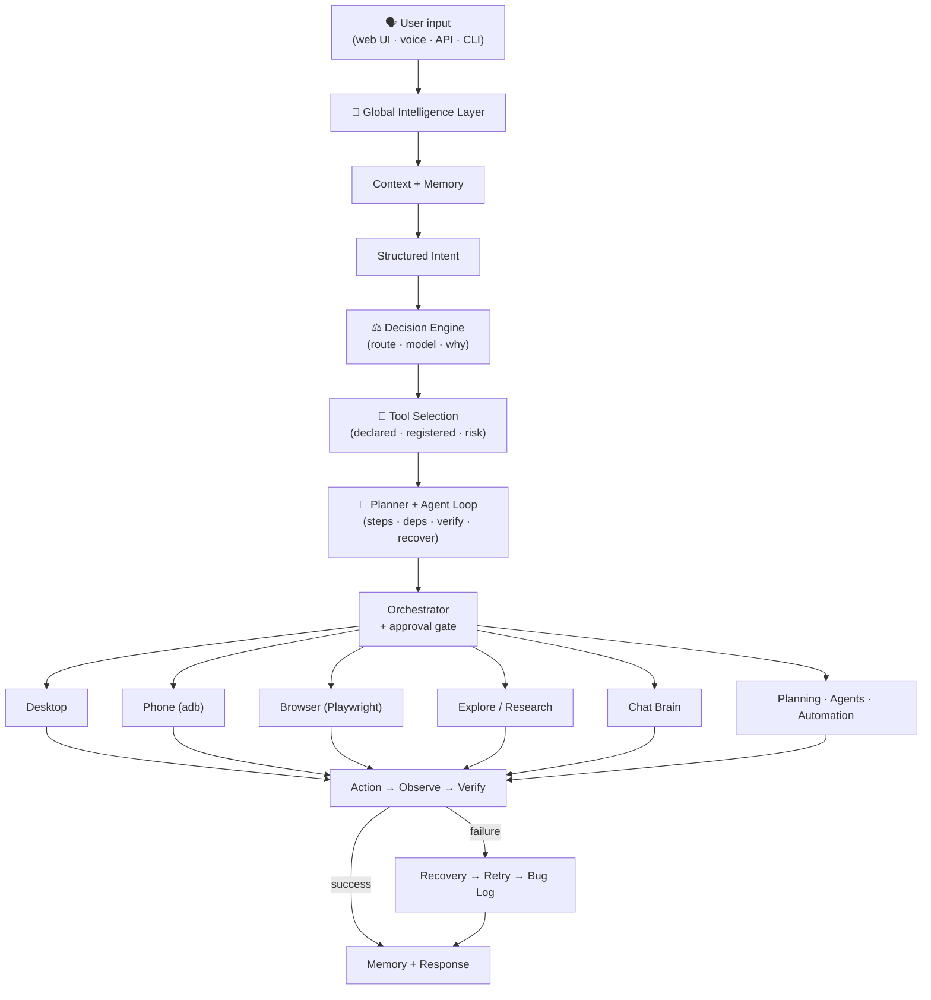

# NovaControl

> 🤖 **An AI-powered desktop automation assistant** — it understands natural-language commands and actually *does* them: driving your desktop, browser, and Android phone, with vision-guided verification, a live web UI, and a built-in bug journal.

NovaControl is a local-first, agentic computer-control system. You type or speak a command like *"open steam and go to library and launch gta v"*, and NovaControl normalizes it, resolves typos and context, plans ordered steps, executes them, and **verifies the result** — asking a precise clarification question only when the request is genuinely ambiguous.

One brain → many capabilities:

| Capability | What it does |
|---|---|
| 🧠 **Global Intelligence Layer** | Normalization, typo tolerance, intent detection, context/reference resolution, multi-intent decomposition |
| 🖥 **Desktop automation** | Open any installed app or folder, in-app chains, dictation, window focus, screenshots (Windows) |
| 🌐 **Browser automation** | Playwright-backed navigation, extraction, form filling, and web-app checks behind an approval policy |
| 👁 **Vision** | Screen understanding, guided clicks ("click the Library button"), pixel-diff verification, optional multimodal vision model |
| 📱 **Phone control** | Android over adb: launch apps, verified screenshots, pre-filled texts/calls |
| 🔎 **Research** | Multi-stage research pipeline that streams live progress into the UI; topics suggested from live daily news, answers synthesized from site-chrome-cleaned facts |
| 🧭 **Local by default** | A cloud key is STORED when you paste it and never becomes the brain until you pick Cloud in the Brain switch — auto mode means the local Ollama model when one is running, otherwise the offline scratch engine |
| 💬 **Dual brain** | Fully local scratch brain — incl. worded & exam-grade (JEE) math — or a real LLM: local **Ollama** (with a model picker) or a cloud key (**OpenAI-compatible, Gemini, Groq, and Claude** speaking its native `/v1/messages` protocol) |

---

## ✨ Key Features

- **Natural-language understanding that forgives humans** — punctuation, capitalization, spacing, and common typos all collapse to the same structured intent:

  | You type | NovaControl understands |
  |---|---|
  | `open chrome`, `open chrome.`, `Open Chrome!`, `OPEN   CHROME`, `please open chrome`, `launch chrome`, `opn chrme` | **OPEN_APPLICATION(chrome)** — all identical |
  | `take a screenshot`, `capture my screen` | **TAKE_SCREENSHOT** |
  | `text mom on my phone saying hi` | **PHONE_SEND_TEXT(recipient: mom, message: hi)** |
  | `open it` (after opening Chrome) | **OPEN_APPLICATION(chrome)** — resolved from context |

- **Layered resolution** — deterministic fast path → fuzzy typo correction → learned variations → contextual/reference resolution → semantic LLM fallback → one precise clarification. Trivial punctuation differences never wake the model.
- **Worded & exam-grade math, fully offline** — the scratch brain's declarative phrase registry computes compound worded arithmetic ("what is 2 cubed plus the square root of 9"), percentages ("15 percent of 200"), the natural fraction family ("half of 10", "one quarter of 8", "a third of 90", "three quarters of 200" — bare, article, and spelled numerators all work), large-scale operands ("3 million times 2", "2.5 billion divided by 4", "half of three million" — digits or words, through trillion), unit/time conversions, and JEE-style questions: logs (`log base 2 of 8`), degree trig (`sin 30 degrees`), combinatorics (`10C3`, `8 choose 2`, `factorial of 5`), full quadratic solving with discriminant and roots, and arithmetic-progression term/sum questions.
- **Multi-intent decomposition** — *"open notepad and take a screenshot"* becomes two planned, ordered steps.
- **Concurrent-activity safe** — every research and command execution is tagged with a run-scoped `correlation_id` that flows from the request through the event bus to the SSE channel; the web UI routes each progress frame to the run that owns it, so parallel activities never bleed into each other's panels.
- **Learning loop** — fuzzy/contextual resolutions teach the phrase back to the registry, so the same typo takes the fast path next time.
- **Teachable knowledge** — the Learn tab's *Teach* box and chat's "remember this: …" both persist typed facts as durable knowledge (SQLite-backed KNOWLEDGE namespace, duplicate detection included). Ask about a taught topic later — in chat or the Learn tab's recall — and it comes back: "remember this: the wifi password is hunter2" → "what is the wifi password?" → *"You taught me: the wifi password is hunter2"*.
- **Code-aware Build planning + coding agent** — the Build tab's *Plan The Code* turns a goal plus a language (Python, JS, TS, Go, Rust, Java, C#, C++, Ruby, Shell, SQL) into a real coding plan: language-idiomatic step sequence, a derived artifact file name (goal words → `fibonacci_generator.py`, `todo_cli_go.go`, …), language-appropriate test-file naming, and a drafted code artifact. When a model is configured, **the coding agent** (`core/code_agent.py`) drafts the code, **executes it in a sandboxed subprocess** (fresh temp cwd, no network on POSIX, 15s wall-clock timeout), reads the real interpreter error, and asks the model to fix exactly that — up to 3 fix rounds — shipping only code that ran clean (or an honest failure trace). The agent's draft → run → fix steps render in the Build tab, which also states up front whether the agent is live or only the runnable scaffold fallback is possible. A math-detection **parity corpus** also runs every math phrasing through both scratch.py and the routing explorer's JS mirror in CI, so the two classifiers can never silently drift apart.
  **Plan The Project** extends the same agent to multi-file work: the model returns a JSON file map (2–5 files + an entry point), the entry runs in the same sandbox, and real errors drive fixes to the affected files (same 3-round budget, whole-project re-runs). Every drafted file renders with a per-file Copy/Save, saved artifacts list in a **Saved Artifacts** strip, and **Run** re-executes any saved file through the same sandbox (`POST /build/artifacts`, `/build/run`, `/build/save`).
- **Self-improvement telemetry** — resolutions, clarifications, unknown intents, and failed entity resolutions are recorded and exposed as human-readable improvement findings.
- **Capability registry** — every subsystem declares its intents, required entities, risk level, executor, and *verification strategy*; the orchestrator derives execution and confirmation policy from that table.
- **Safety-first execution** — device actions require a server-minted, single-use, expiring approval token; auto-approve is opt-in.
- **One brain everywhere — Chat and Explore follow the same mode** — Explore's research synthesis uses whichever brain Chat uses (scratch templates, the local Ollama model, or the cloud provider), re-synced on every mode switch and boot; its report cache is keyed per synthesis brain, so switching modes never serves the previous brain's cached answer.
- **Cloud LLM with honest diagnostics** — Settings → Cloud LLM covers every preset with a **Test Connection** button that pings the provider with the pasted key *before* saving it (nothing is persisted on failure; the response names the failing stage — timeout vs rejected key). While a cloud brain is active, the System panel shows lifetime **token usage** (prompt/completion/total per the provider's own usage block) and the **last transport error** verbatim, so a dead key is visible at a glance.
- **Auto-resolving bug log** — open verification bugs are marked fixed automatically (with evidence) when a later pixel-diff proves the click actually changed the screen.
- **Routing Explorer** — a dedicated panel that traces any utterance through NovaBrain's intent gates, showing which rung owns it and a live preview of what you would actually see (the scratch answer text, the research headline, or the plan outline). Traced by the live server (`POST /brain/decide`); an embedded JS mirror takes over when the server is unreachable. A **broad-classifier toggle** re-runs the same utterance through the scratch engine's wide `_classify()` view and highlights where the narrow gate and the broad engine deliberately disagree (order / engine-only / breadth / unknown / match) — including casual phrasings, which the mirror's research detector knows ("things to know about X", "wtf is X", …), drift-guarded against the Python keyword list.
- **Full phone control over ADB** — the J.A.R.V.I.S phone mode opens any installed app (alias or package), runs in-app searches via deep links (YouTube/Google/Maps/Spotify…), texts saved contacts by name (resolved against the device contact book, never split by guesswork), and opens files/folders through the Files app or system chooser.
- **Answers built from content, not chrome** — search snippets routinely glue consent banners, footers, and trademark lines onto real text. A sentence-level site-chrome filter strips them *before* synthesis, so a researched answer explains the topic instead of quoting "By using this site, you agree to the Terms of Use" or "This page was last edited on …". Chat and Explore share the pipeline **and** the filter, so both answer from the same cleaned facts.
- **Research reads the pages, then answers from them** — a search result is a 150-character meta description, and no rule can turn one into an answer, so Explore fetches each source (`explore/page_reader.py`, standard library only) and works from the article's own prose: scripts, navigation, footers, labels, headings, and HTML artifacts are stripped, and the page is what the answer quotes. Reading is an upgrade, never a requirement — a blocked or script-only page keeps its summary, and the report says so.
- **Research answers the question, not the topic's keywords** — a connected model reads the user's own question and plans the searches itself (`explore/planner.py`): what is being asked, and two to four queries covering the angles that exist for it (direct answer, authoritative source, current state, counter-view). Relevance is then judged against that plan, so evidence that never repeats the user's phrasing still counts. Answer synthesis is question-first — the prompt carries the question and the planner's reading of it, plus the page prose, and the model is forbidden from listing source titles or pasting snippets, because a model that echoes the evidence reproduces the keyword-shaped non-answer this replaces.
- **The local answer is ranked evidence, not keyword buckets** — with no model connected, `explore/evidence.py` ranks every sentence the sources contain against the question (term rarity across the result set, how much the sentence actually says, cross-source agreement, specificity, position — no topic word lists anywhere) and composes the answer as prose plus supporting detail, attributed at the end rather than framed as "here is what the sources say about X". The answer, the highlight cards, the key points, and the sections each take a **different** slice of that pool, so the same sentence never appears twice on one page. A connected-but-broken brain (rejected key, stopped Ollama) is named in the report with its own error, never silently downgraded; with no model at all the report says the answer is assembled from source sentences.
- **Chat stays a conversation; Explore keeps the report** — a research question asked in Chat answers inside the chat stream as a structured answer card (the sourced answer text with its "What it is:" / "Key points:" sections, clickable source chips, and an `explore` chip that jumps to the full report); the full research page — sections, sources rail, related videos, follow-up suggestions — lives only in the Explore panel. "How to" instructional questions route to research instead of the chat fallback, and a compound topic needs two content-word matches before a source is accepted, so "container garden" no longer pulls in Docker pages.
- **Understands casual phrasing** — you don't have to type perfect questions. Scaffold forms ("things to know about X", "what should i know about X", "whats the deal with X", "tell me stuff about X", "any facts about X", "wtf is X") all route to research, and the search topic is anchored to what FOLLOWS the scaffold — so "the most important things to know about brics summit 2026" researches BRICS, not dictionary pages for the word "important". Explicit memory-store phrasing ("remember this: …") still outranks research words inside the remembered content.
- **Daily-updates topic suggestions** — the Explore panel's topic chips are never a hardcoded list: they come from `GET /explore/trending`, which fetches live top-story news headlines (Google News RSS, standard library only, no API key), trims each into a research topic, caches for 30 minutes, invalidates by day, and rotates the visible window hourly — so each visit suggests a different slice of what's actually happening in the world. When the feed is unreachable the panel degrades to a few static help examples.
- **Real system telemetry, never invented numbers** — the Command Center's **System Telemetry** section leads the panel with live metric cards (CPU, memory, storage, GPU, network, battery, temperature, uptime) and the ribbon carries a compact **NOVA CORE** indicator (`CPU 18% · RAM 40% · 3 TASKS`) that opens the full read-out. Every value is measured: `psutil` when installed, the platform's own facilities otherwise (Win32 `GetSystemTimes`/`GlobalMemoryStatusEx`/`GetSystemPowerStatus`, `shutil.disk_usage`, Windows GPU Engine perf counters, `Get-NetAdapterStatistics`, WMI thermal zones, `/proc` and `/sys` on Linux). A metric that cannot be obtained renders **Unavailable** with the reason and *no value at all* — never a zero that reads like a sensor reading — byte rates stay "measuring" until a second counter sample exists, and sampled values show their age. Cost is tiered so polling stays free: cheap metrics are read in-process per request, while GPU/network/temperature are sampled by a daemon thread on a slow cadence, so serving a poll never spawns a process (see [docs/TELEMETRY.md](docs/TELEMETRY.md)).
- **Command-center web UI** — one committed design layer over every panel: a fluid layout (`clamp()` gutters, content-sized rails, breakpoints from 1920px down to phones) that reflows instead of clipping, plus a verified fit audit across all 11 panels and 11 widths. The audit also proves the screen shows ONE panel: each nav click is checked for a lone laid-out panel starting inside the viewport (an id-selector `display` rule once beat `.panel { display: none }`, keeping the Command Center rendered underneath every other panel and pushing the panel you clicked below the fold) that fills the workspace instead of leaving a dead strip down the right edge.

## 🧠 Architecture



**Language understanding is a platform capability.** No subsystem parses raw user strings on its own — JARVIS, Research, Automation, and the Browser Agent all consume the same structured intent.

### Key modules

```text
src/novacontrol/
  intelligence/   Global Input Intelligence: normalize, intent rules,
                  context/references, capability registry, telemetry,
                  StandardResult envelope, model lifecycle manager
  decision/       Decision Engine: what to do with an understood request
                  (route, capability, model, requirements) — provider-based,
                  local by default, never executes anything
  tools/          Tool registry, executor, and the tool layer above it:
                  metadata, a catalogue built from every source that knows a
                  tool, discovery that ranks the few relevant ones with scores,
                  strict call validation, output normalization and TTL caching
  planning/       Planner + agent loop: goals into dependency-ordered steps
                  that name a tool, an effect and a way to be verified, then
                  executed with bounded retries behind the approval gate
  brain/          Scratch brain (fully local answers) + LLM chat + routing
  desktop/        Desktop controller, parser/planner, vision-guided control
  phone/          adb bridge: connect, apps, texts, calls, screenshots
  browser/        Playwright runner + approval-aware workflow controller
  vision/         Screen understanding (LLM provider, heuristic fallback)
  agentcore/      Task interpreter, adaptive planner, verifier, recovery
  voice/          STT/TTS via OS-native speech services
  tasks/          Task center (create, update, delete, clear)
  core/           Event bus, runtime, config, security (deny-by-default
                  approvals), bug log, audit trail
  explore/        Research pipeline with live progress events
  memory/         Namespaced memory (SQLite-backed)
  api/            FastAPI surface + single SSE activity channel
  web/static/     The web UI (vanilla JS, no build step)
  gui/            PySide6 desktop dashboard
  cli/            Command-line interface and demos
```

### Safety model

- **Deny-by-default approvals** — device actions execute only with a server-minted, single-use, expiring token issued for that exact plan
- **Auto-approve is opt-in** (Settings checkbox, default off)
- Destructive/ambiguous + high-risk intents require explicit confirmation
- Phone texts and calls are **pre-fill only** — the human always presses send/dial on the device
- Self-improvement applies nothing without a sandboxed preview + approval

---

## 🚀 Requirements

| Requirement | Version |
|---|---|
| Python | **3.12+** |
| OS | Windows (desktop + voice features); Linux/macOS for core web/API |
| Ollama (optional) | Any recent version — local chat brain and/or a local vision model (e.g. `ollama pull qwen3-vl:4b` or `ollama pull llama3.2-vision`). On a CPU-only machine a non-reasoning model (`qwen2.5vl:3b`, `llava`, `moondream`) answers far more reliably — a `qwen3-vl` build that cannot stop thinking spends its whole budget reasoning |
| Android platform-tools (optional) | For phone control |

## 📦 Installation

```powershell
git clone <your-repo-url>
cd NovaControl

python -m venv .venv
.\.venv\Scripts\Activate.ps1
python -m pip install -e ".[dev]"
```

Optional extras (browser automation, GUI, vision, voice, git, database, Redis):

```powershell
python -m pip install -e ".[browser,gui]"
```

## ⚙️ Configuration

NovaControl is configured via environment variables — no `.env` file is required to run:

| Variable | Purpose | Default |
|---|---|---|
| `NOVACONTROL_API_TOKEN` | Require bearer-token auth on protected API routes | *(auth off)* |
| `NOVACONTROL_ENV` | Environment name | `dev` |
| `NOVACONTROL_LOG_LEVEL` | Logging level | `INFO` |
| `NOVACONTROL_REQUIRE_APPROVAL` | Toggle approval enforcement | `true` |
| `NOVACONTROL_DATABASE_URL` | Database connection (SQLite default) | local SQLite |
| `NOVACONTROL_REDIS_URL` | Redis for optional worker/queue features | — |
| `NOVACONTROL_OLLAMA_URL` | Ollama endpoint for the LLM brain | `http://127.0.0.1:11434` |
| `NOVACONTROL_DISABLE_OLLAMA` | Skip Ollama auto-detection | unset |
| `NOVACONTROL_OLLAMA_UNLOAD_ON_SWITCH` | Unload the other local model before a completion, so only one is ever resident | `on` |
| `NOVACONTROL_OLLAMA_KEEP_ALIVE` | Residency window applied to a model (re)loaded on a switch (e.g. `30m`) | Ollama's own default |
| `NOVACONTROL_ENABLE_EXTERNAL_LLM` | Enable OpenAI-compatible/Gemini-style cloud providers | unset |
| `NOVACONTROL_LLM_BASE_URL` | Cloud provider base URL | — |
| `NOVACONTROL_LLM_API_KEY` | Cloud provider API key | — |
| `NOVACONTROL_LLM_MODEL` | Model name | provider default |
| `NOVACONTROL_LLM_TIMEOUT` | Socket timeout in seconds for every provider request — raise it for CPU-only local models, which answer far slower than a cloud API | `600` |
| `NOVACONTROL_OLLAMA_MAX_TOKENS` | Reply ceiling for local completions — stops a reasoning-capable model from generating without bound; `0` disables it | `1024` |
| `NOVACONTROL_VISION_MAX_IMAGE_SIDE` | Longest edge (px) a screenshot is downscaled to before the vision model sees it — the main lever on local vision latency; coordinates stay resolution-independent, `0` sends full resolution | `1280` |
| `NOVACONTROL_VISION_MAX_TOKENS` | Reply budget for a locate request (one small JSON object is all it needs); `0` leaves it uncapped | `256` |
| `NOVACONTROL_NLU_FAST_CONFIDENCE` | Confidence at or above which a reading is trusted as-is — no verification, no model | `0.90` |
| `NOVACONTROL_NLU_VERIFY_CONFIDENCE` | Below this, understanding escalates to the language model (or asks a question when no model is available) | `0.70` |
| `NOVACONTROL_NLU_MULTI_STEP_CONFIDENCE` | Confidence a multi-clause request's *weakest* clause needs before it needs no extra verification | `0.88` |
| `NOVACONTROL_NLU_LEXICAL_CONFIDENCE` | Similarity the exemplar matcher must reach before it may claim an intent | `0.62` |
| `NOVACONTROL_NLU_REFERENCE_CONFIDENCE` | Confidence assigned to a target resolved from context ("open it") — lower than a named one, by design | `0.74` |
| `NOVACONTROL_NLU_ALLOW_LLM` | Allow understanding to escalate to a language model at all; `false` keeps the deterministic path and asks a question instead | `true` |
| `NOVACONTROL_NLU_LEXICAL_MATCHING` | Enable the TF-IDF/character-ngram exemplar matcher (the paraphrase layer) | `true` |
| `NOVACONTROL_NLU_SEMANTIC_CONFIDENCE` | *Calibrated* confidence an embedding match must reach before it may claim an intent — not a raw similarity | `0.60` |
| `NOVACONTROL_NLU_SEMANTIC_MATCHING` | Enable the embedding index (the second, independent paraphrase layer) | `true` |
| `NOVACONTROL_PLANNING_MAX_CYCLES` | How many understand→decide→plan→execute→verify cycles the agent loop gets before it stops and reports | `2` |
| `NOVACONTROL_PLANNING_MAX_STEP_ATTEMPTS` | Total attempts one plan step may have; `1` means "run once, never retry" | `2` |

> 🔐 **Secret handling:** API keys are stored locally and never returned by any API endpoint. This includes the vision-model key (`POST /vision/model` accepts it once and only ever reports a redacted tail). Never commit `.env` files or tokens — local artifacts like `token.txt` should stay out of version control.
>
> 💡 **Key formats matter:** each preset expects the key from that provider's own console — the Gemini preset wants an AI Studio key (`AIza…`), not a Vertex/ADC credential (a mismatch shows up as HTTP 400/401 on first chat). Use **Test Connection** in Settings → Cloud LLM to verify a key before saving it.

## 🏃 Usage

### Run the web app

```powershell
python -m uvicorn novacontrol.api.app:create_app --factory --host 127.0.0.1 --port 8000
```

Open **http://127.0.0.1:8000/** and try:

- `open notepad and type hello`
- `what is quantum tunneling` (research — streams live stages)
- `take a screenshot on my phone`
- `whats the deal with brics summit 2026` (casual phrasing — routes to research, searches the actual topic)
- The Explore panel opens with **today's news topics** as one-click research chips

### Natural-language command examples

```text
open chrome                              → launches Chrome, verifies the window
open steam and go to library and launch gta v
                                         → 3-step plan: launch → deep-link navigate →
                                           vision-guided launch with process verification
open notepad and type meeting notes      → dictation via clipboard-staged paste
open downloads                           → opens the folder in Explorer
open games folder                        → finds the real folder across drives and opens it
what is 2 cubed plus the square root of 9 → 11 (offline scratch brain)
log base 2 of 8 plus 10C3                → 123 (JEE-style: logs + combinatorics)
solve x^2 - 5x + 6 = 0                   → worked quadratic solution with roots
stop that                                → graceful WM_CLOSE of the last app
open youtube on my phone                 → launches YouTube on the paired device
search cats on youtube on my phone       → YouTube deep-link search (nothing typed)
open the report.pdf file on my phone     → opens the file via the system chooser
open the downloads folder on my phone    → opens the Files app
open steam and go to library and launch gta v
                                         → 3-step desktop plan: launch → deep-link navigate →
                                           vision-guided launch with process verification
take a screenshot on my phone            → PNG pulled to data/screenshots/, verified
text sesi 2 saying hi from NovaControl  → resolves the saved contact → pre-fills messaging; you press send
how to start a container garden on a balcony → researches gardening (not Docker)
whats the deal with quantum computing    → researches quantum computing
tell me stuff about the mariana trench   → researches the mariana trench
remember this: facts about cats          → stores to memory (does NOT research cats)
add five and seven                       → 12 (spelled-out add form)
remember this: my wifi password is hunter2
                                         → taught as durable knowledge (Learn tab / chat)
what is the wifi password                → "You taught me: my wifi password is hunter2"
```

### How Explore understands what you type

Research queries rarely arrive as perfect sentences, so Explore's language layer anchors on **scaffold markers** instead of rigid grammar: the real topic is whatever *follows* "things to know about", "should i know about", "the deal with", "stuff/facts about", "info on", "wtf is", "basics of". The router accepts the same casual forms, so "whats the deal with quantum computing" routes to research *and* searches for quantum computing — not for "deal". Scaffold adjectives never leak into the search (the fix for researching the word "important" instead of the BRICS summit). Sources must clear a topical-relevance gate: a compound topic ("container garden", "brics summit 2026") needs two content-word matches from a page, so Docker and shipping-container pages can't answer a gardening question, while comparison topics ("compare email, chat, and phone calls") stay per-item.

### Web interface

The browser UI is a single-page command center served by the API (`/`): a grouped sidebar (Core / Intelligence / Automation / Engineering) over eleven panels — **Command**, **Chat**, **Explore**, **Routing**, **J.A.R.V.I.S**, **Vision**, **Build**, **Learn**, **System**, **Settings**, **CLI** — backed by one SSE channel (`/events/stream`) for live progress and the Recent Activity timeline.

Layout is fluid rather than fixed: gutters, heights, and rails are `clamp()`-based tokens, so the same markup reflows from a 1920px desktop to a 390px phone without a separate mobile build. The navigation is never an overlay: the sidebar is a column at every width where a column fits (268px, narrowing to a 214px rail below 1040px) and becomes a top command deck below 700px, whose pills **wrap into rows** so every destination stays visible (never hidden behind a sideways scroll). There is no off-canvas drawer and no hamburger — a drawer covered the panel the reader had just opened, which reads as clipped content; `scripts/ui_audit.py` now fails the build if the sidebar is fixed over the workspace or has no width at any audited breakpoint. The stylesheet is a single design-token block plus one component layer — consolidated with a **computed-style A/B audit** (`scripts/ui_audit.py --baseline <old.css>`) that proves a cleanup changed nothing the browser can see — and reduced-motion is respected throughout.

The Command Center opens with **System Telemetry**: a `SAMPLED 12S AGO` freshness pill, then metric cards (CPU, memory, storage, GPU, network, battery, temperature, uptime) with a live bar each, a pill row for AI engine / Vision / automation / active tasks, and a **Details** table (host, OS, CPU model, cores, uptime, sensor backend, GPU, network interfaces, cloud brain, tracked tasks). Cards are built once and updated in place, so the bars animate to each new reading; the poll runs every 2s and pauses while the tab is hidden. A metric this machine cannot report is muted and says why — on an Intel-integrated laptop the TEMP card reads *Unavailable — the firmware reports no ACPI thermal zone*, and VRAM is reported as `shared` GPU memory rather than a fabricated total.

Chat presentation follows conversation conventions on purpose: research answers arrive as structured answer cards — the answer text with its heading sections and bullets, source chips, and an `explore` hand-off chip that renders the already-fetched report into the Explore panel (no second research round-trip) — while the full report furniture (query chip, verification, sources/videos rail, follow-up question chips) remains the Explore panel's job. `ChatResearchBubbleDomTests` pins this split — the Explore page must never render inside the chat stream. The Explore panel's welcome card shows live **trending topic chips** (today's news, rotating hourly) instead of fixed examples.

Verify the UI end to end:

```powershell
$env:PYTHONPATH='src'
python -m pytest tests/ -q            # includes the UI contract + focus-ring + reduced-motion suites
python scripts/ui_audit.py --url http://127.0.0.1:8000/                  # every panel fits at every breakpoint
python scripts/ui_audit.py --url http://127.0.0.1:8000/ --baseline old.css  # zero computed-style drift
```

### Voice input

The J.A.R.V.I.S tab has a **VOICE** button using OS-native speech recognition and synthesis (Windows); see [docs/VOICE.md](docs/VOICE.md).

### Phone control setup

1. Download [Android platform-tools](https://developer.android.com/tools/releases/platform-tools) and unzip (NovaControl auto-finds it in `~/platform-tools` even when it's not on `PATH`)
2. On the device: **Settings → About → tap Build number 7×** → **Developer options → enable USB debugging**
3. Plug in over USB → press **Connect Phone** in the J.A.R.V.I.S tab → accept the RSA prompt on the device

Once paired, phone mode can: **open any installed app** (by alias or package name, discovered from the device), **search inside apps** via deep links (`search cats on youtube on my phone` opens YouTube pre-loaded with the query — nothing is typed), **text a saved contact by name** (the leading words are resolved against the on-device contact book first, so free text is never split by guesswork; the messaging app is pre-filled and *you* press send), **call by saved name** (dialer pre-filled), and **open files/folders** (a named file opens through the system chooser; folders land in the Files app). Bridge status and next steps are surfaced in the J.A.R.V.I.S phone tab, and every executed action lands in the Recent Activity timeline.

> 🔮 **Beyond USB: a no-cable future.** Android 11+ wireless debugging (pair once over Wi-Fi, no cable) is the cheap path and needs zero code rewrites. For control **without USB debugging at all**, [docs/PHONE_COMPANION_APP.md](docs/PHONE_COMPANION_APP.md) sketches a companion Android app built on an AccessibilityService — the phone dials out to NovaControl over WebSocket and becomes a third `PhoneCommandRunner`, unlocking semantic-tree element location for vision-guided phone flows. Sketch only; nothing implemented yet.

### Routing Explorer

The **Routing** panel answers *"where does my utterance land?"*. Type any phrase and it shows the full gate walk — every intent gate NovaBrain evaluates in order, which one matched (and why), the landing intent with confidence, and a small preview of what you would actually see on that rung:

- **scratch** rungs (greetings, math, conversions, knowledge) — the real local answer text;
- **explore** — the report headline the research run would produce;
- **plan / device actions** — the real plan outline and action list.

While the server is up, tracing runs live through `POST /brain/decide` (the landing decision *is* `NovaBrain.decide()` — the explorer can't disagree with chat). If the server is unreachable, an **embedded JS mirror** of the gate table takes over so the explorer still answers offline; it is labelled as approximate in the UI, and its gate names/order are drift-guarded against the Python table in CI.

A **"Compare with broad classifier"** toggle re-runs the same utterance through the scratch engine's *broad* `_classify()` view and highlights where the narrow routing gate and the broad engine deliberately disagree: **order** (e.g. `what time is 2 plus 3` — the narrow router promotes math ahead of time), **engine-only** (`open notepad and type hello` — the broad engine sees desktop_control but its row is routing_safe=False so routing dispatches to real automation instead of a canned answer), **breadth** (a wide engine match with no exact canned key), **unknown** (neither classifier has a local answer), or **match**. The JS mirror computes the same relation offline, and the Python↔JS relation parity is drift-guarded in CI.

### How a request is understood

Every request passes through the **Global Input Intelligence** layer before any subsystem sees it, and the cheapest layer that can understand the request wins:

```
normalize → rules → fuzzy (typos) → learned phrasings → context → exemplar similarity (TF-IDF)
    → embedding similarity (optional)
    → language model (only if still unresolved)
         ↓
    complexity assessment → multi-signal confidence → route
```

The reading is then scored against configurable confidence bands, and the band decides what happens next — never the other way around:

| Reading | Route | What happens |
|---|---|---|
| confident (≥ `NOVACONTROL_NLU_FAST_CONFIDENCE`) | `fast` | straight to the capability, **no model** |
| borderline | `verify` | accepted, flagged as below the fast band |
| a reference resolved from context ("open it") | `verify` | planned, but never as certain as a named target |
| low confidence, or a clause that could not be understood | `llm` | escalated to the language model, which answers in the **same structured schema** |
| understood and already answered | `fast` | the result speaks for itself — it is **never re-worded** through a model |
| needs an image | `vision` | the vision pipeline — a text-only model is never handed a screenshot |
| no reading and no model | `clarify` | one precise question instead of a guess |

The vision route is decided by the request rather than by how well it was read: *"describe the image on screen"* resolves to nothing the words can act on, but it is still flagged `requires_vision` and routed to vision — a dead-end question would hide that the request is answerable by *looking*. The record says where the request went, not only that it was asked about, so a vision-routed request is counted as vision rather than as a plain question. A **bare continuation** is memory work, and says so: *"continue from where I stopped"*, *"resume"* and *"where was I"* resume whatever the context layer knows was in progress, and reach the model (or one precise question) only when nothing is remembered. Similarity is no help there — *"continue from where I stopped"* scored 0.57 raw against a GPU-status exemplar, above the embedding floor — so the embedding layer declines continuations outright instead of answering them. *"Continue **the project I was working on yesterday**"* names something and keeps flowing through the pipeline, because only the *bare* form is context work.

Two rules keep that table honest. **A name the user actually said always beats a remembered reference:** *"where is my NovaControl folder"* is read as that folder, and *"read notes.txt"* or *"open notes.txt"* is a file to read — never an application literally called *notes.txt*. Only a phrase that names a **kind** and nothing else (*"open that file"*, *"run that"*, *"show me the thing"*) is resolved from context, at reduced confidence, or asked about when nothing is remembered. **Entities come from independent readers** — application, file, folder, project, url/website, query, level, text, numbers — so *"find my NovaControl project"* yields `project: novacontrol`, *"set volume to 40%"* yields `level: 40`, and a new entity type is a new reader rather than a new branch in the engine. **A project is a folder under another name, never an application:** *"open my NovaControl project"* reads as `project: novacontrol` (mirrored to `folder` for the capability that opens it), because the generic *"open ___"* rule used to read the whole phrase as a program called *novacontrol project* and try to launch it. The desktop planner was making the same mistake one layer down — it re-parses the raw request — so the project pattern now lives there too: *"open my NovaControl project"* plans `Open folder novacontrol`, which the on-disk folder resolver turns into the real folder.

So the common cases never touch a model: *"open chrome"*, *"launch chrome"* and *"please bring up Chrome"* resolve in well under a millisecond, and *"how much RAM do I have?"* is answered from the machine's own telemetry ("You're currently using 10.9 GB of 15.4 GB RAM (71.1%).") with no model involved at all. Multi-step language that every clause of is understood stays local too — *"Open VS Code, find my NovaControl project and run the tests."* decomposes into three planned steps without a model. Only genuinely novel, ambiguous or partly-unreadable language reaches the local model — and when it does, the model **understands**: it returns an intent, goal, entities and requirement flags, and NovaControl validates, authorizes and executes. A model never names a tool, a path or a command.

**Understanding is not the whole wait.** A command can be understood in a millisecond and the request still take over a minute — because the *result* was also being sent to a model to be re-worded. *"open chrome"* produced a finished sentence (`Planned: Open chrome`) and then asked the local model to paraphrase it: **86 s of the 87 s**. A result that already reads as a sentence — a chat answer, a research report, a measured reading, a planned step list — is now returned verbatim, and the model words only results that arrive with no sentence of their own. The same request went from **86.1 s to 2.2 s** (measured, same machine, same model configured).

**Honest about what is not built yet.** Nineteen of the taxonomy's intents — the file operations (`find_file`, `read_file`, `list_files`, `write_file`, …), the device controls (`volume_control`, `brightness_control`, `media_control`) and the code-intent family — are *understood* but have no executor wired to them, so they fall through to the existing handlers exactly as before. That gap is written down rather than hidden: every intent the rules can produce must be either dispatchable or listed in the drift-guard test (`tests/test_nlu_engine.py`), so adding rules for a capability with no executor fails the suite until it is wired up or deliberately documented.

**One table describes every intent.** Examples, required and optional entities, the tool that carries it out, whether it needs confirming, the web or vision, and the confidence bar it must clear all live in one declarative catalog (`intelligence/registry.py`) — so an intent added there shows up in the engine, the telemetry and the UI without a second edit, and two modules cannot quietly disagree about what *"delete report.pdf"* means. The catalog is why the two questions *"which intents exist"* and *"which of them can actually run"* now have separate, checkable answers. It is also the single description every layer is judged by: the flags on a reading — needs the web, needs vision, needs confirmation — are derived from the catalog no matter which layer produced it, so a hand-composed reading (the composite *"open chrome and search youtube for X"*) cannot quietly disagree with the same intent read from a rule. A test sweeps the layers for exactly that disagreement. Names the specification uses that this taxonomy spells differently are data, not prose: `launch_website`, `create_file`, `execute_command`, `screenshot`, `explain` and `unknown` resolve to the real intents through `resolve_intent()`, so an API client written against the spec's vocabulary is routed by this system's.

**A second paraphrase layer, measured before it was trusted.** TF-IDF needs shared words; an embedding index is the layer that reads *"what is chewing up my ram"* when the exemplar says *consuming* and *memory*. It is optional in both directions — nothing to download (the default vector space is a deterministic hash of content-word, bigram and character n-gram features, weighted by corpus rarity, so it works offline and produces identical output across processes), and a deployment that *has* an embedding model passes one in as a backend, replacing the vector space without touching the engine. It is consulted only where the term-matching layer already declined, and its floor is on the **calibrated** confidence rather than the raw similarity. That distinction was earned, not assumed: a leave-one-out benchmark over the shipped corpus (rebuild the index without the query, read every phrase back — `tests/test_nlu_semantic.py` keeps it running) showed that *"show me the florb"* scores **0.61 raw** against *"show me the documents folder"* while being a near-tie with a different intent entirely, so similarity alone would happily act on nonsense. On calibrated confidence the same sweep gives 62% precision at 8% coverage — twice the precision the existing TF-IDF layer manages at its own gate — and the layer **declines** everything below it, records why, and reports itself as an *embedding match*, never as the language model.

**A confidence number with arithmetic behind it.** Confidence is not one similarity score wearing a label. It combines the rule or lexical match strength, entity completeness (measured against the catalog's declared requirements), how close the runner-up candidate came, whether a context reference was resolved, and whether the request needs the web or vision. A tie between candidates *lowers* the reading, and a missing required entity lowers it without zeroing it — so *"open chrome"* lands at 0.90 and *"open it"* at 0.74, capped below any named target by construction rather than by a special case.

**Complexity decides the machinery, not the word count.** Every reading is assessed as SIMPLE, MODERATE or COMPLEX by counting actions, dependencies between them, unresolved references, ambiguity and reasoning words — never length. *"Open Chrome"* is local work; *"Open Chrome and search YouTube for Python tutorials"* is MODERATE and needs the planner, counting the composite reading's own actions rather than the single step it used to be scored as; *"Find the project I was working on yesterday, inspect the latest changes, run the tests and explain what I should fix"* is COMPLEX and is the one case that goes to the model *because of its shape* rather than its confidence.

**What is taught is what generalizes.** The learning loop turns a phrasing that needed a second layer into a rule for next time — but never for a phrase whose meaning is *"the last thing"*. Such a phrase is taught *above* the context resolver, so a lesson freezes what *"that"* meant the first time: measured, *"do the same thing"* was taught against a file read and then replayed that read even after an unrelated browser task. Phrases carrying a resolved reference, a bare reference (*"run that"*) and bare continuations are therefore excluded — they keep following the current context, which is the only thing that can answer them.

**Measured, not estimated.** A local model reports its own timings, and those are what get recorded: how long the weights took to load, how long before the first token, the decode rate and the true inference total, alongside the NLU's own latency and the end-to-end time. A cloud provider reports none of that, and says so — an unmeasured path records nothing rather than a fabricated zero. `GET /intelligence` returns the aggregate under `model_timings`.

Every record carries the **request id the client is given**, and the outcome is reported against that same id one layer up, where the handler runs: *carried out* or *failed*, with the exception's type. An outcome nobody reported stays absent rather than counting as a success, so "understood correctly, then failed" is a discoverable fact instead of two records that happen to share a minute.

**Then a decision, before anything runs.** An understood request is handed to the **Decision Engine**, which answers the next question — *what should NovaControl do about it?* — and reports what that therefore needs. It resolves a route (`direct_tool`, `system_tools`, `local_capability`, `planner`, `agent`, `local_llm`, `cloud`, `vision`, `chat`, `clarify`), the capability, the model, the action list, and the requirement flags, beside a stable `reason_code` and a templated sentence for the UI. It executes **nothing** — authorization stays with the approval layer — and it is a pure function of what it is told, so the same reading and the same machine produce the same decision. The order is cheapest first, and two rules are load-bearing: **a model is never consulted when determinism is enough** (*"what is my RAM usage?"* and *"open chrome"* name no model at all), and a status question is answered from this machine's own telemetry rather than from a model's guess. The chain is `decide → plan → select tool → approve → execute → verify`, and the reason each step exists is that it can refuse the next one.

**A provider can advise, never authorize.** The engine is local-first and offline by default; a second provider (the optional **Jev** integration) sits behind the same `DecisionProvider` interface, is consulted only when an endpoint *and* consent are both configured, and receives a **redacted** routing summary — intent, flags, complexity and what the machine has, never the user's words or entities. Its replies are validated against the local vocabularies: an unknown route is refused rather than mapped to something convenient, actions are kept only when the local reading produced them too, the handler is always resolved locally (a remote service may suggest a route, never name an executor), and caution is **monotone** — a provider may add a confirmation requirement and can never clear one. If it is slow, absent or wrong, the local decision answers instead and the fallback is reported rather than hidden (`provider_fallback`), because an invisible fallback is how a broken provider goes unnoticed for a month. An unknown provider name in configuration maps to the local one and reports what was *requested* next to what is *active*, so a typo is visible instead of silent.

**Two rules held under test.** The four examples the decision spec names run as tests, and checking them against the engine found three defects that are now fixed. A reading that names two metrics — *"check my RAM and CPU"* — answers **both**, rather than the first one it happened to match. And a request that names **work** (it needs a model, a planner, or entities that are still unresolved) is never answered with a question: only a genuinely ambiguous request is clarified, so escalation and clarification cannot be mistaken for each other. Context is an input like any other — a broken context layer costs the decision its context, not its route.

**A plan is a graph of steps that say how they will be checked.** *"Open VS Code, open my NovaControl project, run the tests and tell me what failed"* is not four steps, because the request contains prerequisites nobody said out loud — the project has to be **located** before it can be opened, a test run has to be **collected** before its failures can be **analysed**, and an analysis has to exist before it can be **summarised**. The compiler emits all seven, in that order, each naming its action, tool or capability, parameters, dependencies, expected result, verification and status — plus what it does to the world, because that one field decides three separate rules: whether a step may run in parallel, whether its result must be verified, and whether it may ever be retried. Execution walks the graph a wave at a time and runs steps **concurrently only when every one of them is read-only and none names the same resource** — one read-only tool legitimately serves CPU, RAM and GPU readings at once, while two steps about the same file are not independent even if both only read it. A step that changes something waits for the previous such step, and a failure blocks everything downstream rather than being discovered later at a worse moment. The two loops that could hide a permanent failure behind repetition — a step's attempts and the agent loop's cycles — are **configuration, not constants** (`planning.max_cycles` / `planning.max_step_attempts`, or `NOVACONTROL_PLANNING_MAX_CYCLES` / `NOVACONTROL_PLANNING_MAX_STEP_ATTEMPTS`), read once at boot and handed to the compiler, the executor and the loop alike; a value above the plan layer's own ceiling is clamped rather than obeyed, because a ceiling that can be configured away is not a ceiling.

**Nothing is called done because it returned.** A step is COMPLETED only after its verification PASSED; a step that ran and could not be checked is reported **unverified**, which is different from a failure and very different from a success, and those unverified steps travel into the final answer instead of being rounded up. Verification is required by policy for every side-effecting action and optional anywhere else, reads evidence rather than opinions (a file, an exit code, captured output, an observed change, a named check) and returns **inconclusive** when it genuinely cannot tell — the honest answer, and not a soft pass. A nonzero exit code is a *result* when the goal was "tell me what failed", so the run for a test suite accepts any exit code while still capturing it for the analysis.

**A retry is a decision, not a hope.** When a step fails, the recovery advisor classifies the failure and chooses one of four answers with a reason: retry (transient, budget left), repair the parameters (the error said *which* argument was wrong and how — a corrected attempt is a different attempt), escalate for reasoning, or stop. Destructive and external actions are **never** retried automatically, because a delete that half-succeeded, run again, deletes something else; a refusal is never retried, because only a person can change it. Retry limits are configurable and the policy's own ceiling makes an unbounded loop unrepresentable rather than merely unlikely.

**The agent loop is the only driver, and it cannot skip the last two phases.** UNDERSTAND → DECIDE → PLAN → EXECUTE → OBSERVE → VERIFY → CONTINUE/RETRY/ESCALATE → FINAL RESPONSE runs on a bounded cycle count, and a decision that says "ask first" ends the run before anything is planned, let alone executed. The planner requests actions; it never authorizes them. A step that needs confirmation runs only when the caller approved **that step id** — with no approval channel wired it is **denied rather than attempted**, a tool refusing is a denial rather than a failure, and every tool call still goes through the approval-gated executor, so there is no path from a plan to the machine that skips the existing safety layer.

**Which tool, with the evidence.** "This intent reaches that tool" used to be a single lookup. The **selection layer** resolves it from three surfaces that can disagree — the catalog's declared tools (in preference order), the capability's executor, and the runtime tool registry — and scores each candidate on that order, whether the tool is actually registered, whether the entities it needs are present, and how risky the capability says it is. Missing required entities *lower* the score without disqualifying the tool (an incomplete step is what the approval prompt and the clarification question exist for), a registered tool whose schema says it serves the intent is offered alongside the declared ones, and a registered tool whose name merely looks related is **never** guessed into service. It reports `declared` / `registered` / `executor` as the source and prunes what it did not choose into the candidate list, so a surprising choice is traceable to the surface that suggested it. Like the decision it feeds, it runs nothing — a selector that could approve its own choice is the one thing this layer must not be.

**Every tool is described, and only the relevant few are offered.** A tool used to be a name, a schema and a callable — enough to run one and not enough to *find* one, so nothing could answer *"which of these could possibly be what the user meant?"*. Each of the twenty executors this build knows about now carries metadata: a description in the words a request would use, a category, the capabilities it serves, its input and output schema, its risk, its permission scopes, example requests and tags. One catalogue is built from every surface that knows a tool — the declarations, the intent catalogue (which tool carries each intent, plus the phrases people say), the capability registry (executor, risk) and the runtime registry (what is actually registered) — so nothing is described twice and a tool that is dispatched but not wired up is reported as exactly that. **Discovery** then ranks that catalogue against a request using the lightweight machinery the NLU layer already had: content words weighted by the square of their rarity ("ram" decides, "up" does not) combined with cosine similarity over hashed n-gram features. *"Which programs are consuming most of my memory?"* returns `system_monitor` at 0.73 and **not** the phone, the browser or the code agent; *"what is chewing up my ram"* lands on the same tool, which is the point of the semantic half; and a request nothing can serve (*"sing me a lullaby about penguins"*) returns **no tool at all**, because that is a real answer and it is what stops a planner reaching for something unrelated. Embedding support stays optional — a caller with a model passes it as the embedder and the layer uses it instead. The model escalation is shown this shortlist, never the whole toolbox.

**A call is validated, its result bounded, and its answer reused only when that is safe.** The pipeline is `ToolCall → schema validation → permission validation → execution → normalization → (cache store)`, and the strictness is what matters: an **undeclared argument is refused** rather than passed along to the implementation, `{"command": ""}` is refused because it runs nothing and reports success, and a type name no schema can satisfy fails when the schema is *constructed*. Results are bounded before any model sees them — a ten-thousand-line test run arrives as an exit code, a one-line `error_summary`, the relevant lines and a `lines`/`truncated` count — and a small result is left exactly as it was. Caching is opt-in per tool and per operation: only a tool may declare its result reusable, `volatile_values` names the readings that change between calls (a cached CPU percentage is a lie nobody can see), and failures, denials and empty results are never stored. Everything the cache and the normalizer *decline* is counted and reported rather than silently skipped. Three read-only tools are **registered for real** on a default install — `machine_facts` (operating system, CPU, total memory, disk capacity), `capabilities` (what this build can do, with risk and executor) and `installed_applications` (the machine's real inventory, read from the same index `open <app>` resolves against) — so that pipeline runs on real work rather than only in tests, and they are exactly the operations the specification names as worth caching. None returns a moving number: free space and uptime are live readings and stay with `system_monitor`, which declares them volatile, because a result reused for ten minutes must not answer with a value that changes in one. Each tool's **input schema** is derived from the entities the two surfaces already record — the intents a tool carries out (`desktop_controller` expects an `application`) and the capabilities it executes (`file_manager` expects a `file`) — and its **output schema** is a declared contract, so a model is offered a real call shape and a result shape instead of two empty fields. A request made only of function words still lands: *"what can you do?"* reaches `capabilities`, while *"can you help me?"* honestly reaches nothing.

**The planner and the agent execute the decision, not a re-reading.** Handlers receive the decision beside the structured intent, so the planning path can name the tool a plan would reach and whether sequencing or confirmation was asked for, rather than re-deriving it from the sentence. When the selection cannot be rebuilt for a step it is simply absent — reported as an empty selection, never invented.

**A screen request and a question about a screen are different work.** The vision pipeline now carries the user's own question to the model: *"why isn't the button working?"* is asked as that question, with the standard checklist appended (answer it, and note the visible errors and interactive elements), while an explicit *"describe the screen"* keeps the original generic prompt. What counts as a question is decided before capture — the understood goal when there is one, the raw text otherwise, and **nothing** for a bare *"look at the screen"*, where the words are the instruction rather than a question about the picture. And when no vision model is wired, the pipeline does not present a window-title probe as an answer: it returns the question it could not answer, `question_answered: false`, and the reason it could not. A text-only chat model is never handed a screenshot, and a whole-file test suite pins the question's journey from the request to the multimodal message.

Chat answers show a compact readout of exactly this (`Understanding: Fast NLU · Intent: Open Application · Confidence: 92% · LLM: Not required · 0.6 ms`); `GET /intelligence` exposes the same machine-readable picture, including per-layer latency, routing and escalation counts, success/failure counts, the timings above, and the live thresholds. Model lifecycle (load/unload/residency/available memory/active model) sits behind the `ModelManager` abstraction, so *"request understanding"* stays independent of which runtime is installed. On this 16 GB machine the manager is **exclusive by default**: loading a second model evicts what must go first, the plan carries the measured numbers it was made from, *"could not measure"* is never read as *"nothing to worry about"*, and a model that would not fit even after eviction says so instead of thrashing. The NPU is deliberately not assumed — no acceleration path is claimed that has not been measured. `GET /models/status`, `POST /models/load` and `POST /models/unload` expose exactly that surface.

### CLI

```powershell
python -m novacontrol            # interactive CLI
python -m novacontrol demo phase12
```

---

## 🔌 API

FastAPI app factory with REST + SSE + WebSocket surfaces. The full route catalog in [docs/API.md](docs/API.md) is **generated** from the shared route registry (`novacontrol.api.route_consumers`) — after adding a route, run `python scripts/generate_api_reference.py` (CI enforces `--check`). The most useful endpoints:

| Method | Route | Purpose |
|---|---|---|
| `POST` | `/ask` | Natural-language entry point — full pipeline |
| `POST` | `/command/plan` · `/command/execute` | Preview a J.A.R.V.I.S plan, then execute with the minted token |
| `GET` | `/phone/status` · `POST /phone/connect` · `/phone/plan` · `/phone/execute` | Phone bridge control |
| `GET`/`POST` | `/vision/describe` · `/vision/click` | Screen understanding and guided clicks |
| `POST` | `/vision/model` · `/vision/model/clear` | Configure/clear the multimodal vision model (hot swap) |
| `GET` | `/intelligence` | GIL telemetry, improvement findings, capability registry |
| `GET` | `/bugs` · `POST /bugs/{id}/fix` · `POST /bugs/clear-fixed` | Bug log review, resolution, and clearing resolved entries |
| `GET` | `/tasks` · `POST /tasks/delete` · `/tasks/clear` · `/tasks/clear/undo` | Task center (Clear All is undoable) |
| `POST` | `/brain/mode` · `/brain/cloud` | Switch scratch/LLM brain and configure cloud providers |
| `POST` | `/brain/cloud/test` | Ping a cloud provider with a pasted key before saving (one-shot, nothing persisted) |
| `GET` | `/brain/ollama/models` · `POST /brain/local/model` | List installed Ollama models / pin which one the local brain uses |
| `POST` | `/brain/decide` | Trace an utterance through the routing gates, with a per-rung preview and optional broad-classifier comparison |
| `POST` | `/knowledge/teach` · `GET /knowledge` · `POST /knowledge/recall` | Teach durable facts, list them, recall by query |
| `POST` | `/plan/code` | Coding agent: sandboxed draft → run → fix loop (bounded rounds) + plan, scaffold fallback when no model |
| `GET` | `/build/artifacts` · `POST /build/run` · `POST /build/save` | Saved Build workspace files, sandbox re-run of a saved file, save a drafted artifact to disk |
| `POST` | `/explore` | Research pipeline |
| `GET` | `/explore/trending` | Current daily research topics from live top-story news (rotating window; feeds the Explore panel's chips) |
| `GET` | `/events/stream` | Live SSE activity channel — every frame carries a `correlation_id` |
| `GET` | `/chat/history` · `POST /chat/history` | The server-side chat transcript shared by every browser/tab (and `POST /chat/clear` to wipe it) |
| `GET` | `/system/telemetry` | Live machine telemetry for the Command Center — CPU, memory, storage, GPU, network, battery, temperature, uptime, plus active tasks / AI engine / Vision / automation status |
| `GET` | `/health` · `/status` | Health and route metadata (`/health` also reports the build id the page compares itself against) |

Example with auth enabled:

```powershell
$env:NOVACONTROL_API_TOKEN='change-me'

Invoke-RestMethod -Method Post -Uri http://127.0.0.1:8000/ask `
  -Headers @{ Authorization = 'Bearer change-me' } `
  -ContentType 'application/json' `
  -Body '{"text":"open chrome"}'
```

---

## 🖥 Desktop Automation

Windows-first, using Start-Menu scans (`.lnk` index), registry App Paths, UWP/Store catalog, known app aliases, `shell:` deep links, and PowerShell for window verification:

- **Open any installed app or spoken folder** — not just a fixed alias list: Start Menu shortcuts, registry App Paths, UWP/Store apps, and folder names searched across the user profile and drive roots ("open games folder" → `D:\Games` on machines that have one)
- **In-app chains** — *"open steam and go to library and launch gta v"* launches Steam, drives `steam://open/library`, then launches the game via Steam's own `steam://rungameid/<appid>` protocol with a **process-level verification** (window title *or* known launcher process), polled up to 90 s for big titles
- **Dictation** — clipboard-staged paste with foreground-window verification
- **Window focus & graceful stop** — `stop that` sends WM_CLOSE, never a hard kill
- Details: [docs/DESKTOP_AUTOMATION.md](docs/DESKTOP_AUTOMATION.md)

## 🌐 Browser Automation

- `PlaywrightBrowserRunner` (optional extra: `pip install -e ".[browser]"`) with a safe `NoopBrowserRunner` fallback that records intent without launching a browser
- Actions: navigation, extraction, form filling, downloads, web-app checks
- **Approval policy:** navigation/form-fill/download/test actions require approval; extraction from already-available context does not
- Details: [docs/BROWSER_AUTOMATION.md](docs/BROWSER_AUTOMATION.md)

## 👁 Vision

The Vision tab wraps desktop control in a perceive → locate → act → verify loop:

- **Describe Screen** — captures your real screen and reports what's visible
- **Configurable multimodal vision model** — point the whole vision layer at a real vision-capable model (local **Ollama** — qwen3-vl, qwen2.5vl, llava, llama3.2-vision, moondream — auto-detected; or a cloud preset: **OpenAI, Gemini, OpenRouter**) from the web UI's Vision panel or `POST /vision/model`. The screenshot is embedded as OpenAI-format image content and elements are located **semantically** (a 0–1000 grid point), with OCR/landmarks as automatic fallback. The config hot-swaps at runtime, persists across restarts, and the API key is stored only on your machine and never returned by any endpoint.
- **Vision calls are bounded and read tolerantly** — the capture is downscaled to a token budget before the model sees it (the main lever on local latency) while coordinates stay resolution-independent, the reply is capped so a reasoning-only model cannot stall the click for minutes, and every answer is classified as *found* / *not visible* / *unparseable* — a prose sentence that merely mentions a direction is never read as a click location, and only an unparseable reply is worth one stricter re-ask. Points are accepted from the documented `x`/`y` contract as well as centre pairs and bounding boxes (clicked at their centre). On a CPU-only machine prefer a non-reasoning vision model: `qwen2.5vl:3b`, `llava` or `moondream`.
- **A text-only model can never pose as a vision model** — a provider is accepted as vision-capable only when it can actually see: local Ollama models are checked against Ollama's own `/api/show` capability metadata (the authoritative answer, where a name is only a guess), cloud presets against the registered vision-capable list, and the Echo fallback is always refused. This is why `/vision/status` reports the truth on a machine whose chat brain is a text-only model, instead of feeding screenshots to a model that cannot see them and clicking the coordinates it invents.
- **Guided Click** — type a target ("File", "Library", "Play GTA V"); the vision layer locates it via vision model → OCR → UI landmarks, moves the cursor, clicks, and saves before/after screenshots
- **One local model resident at a time** — a local chat brain and a local vision brain cannot both be held in RAM on a small machine, so before any completion the app measures free system memory and asks Ollama what it already holds; if the incoming model would not fit (or simply because exclusivity is the policy) the other model is unloaded first, with a 512 MB headroom so "fits" means "fits and stays usable". Every decision is logged with its measured figures, and an unmeasurable situation is reported as unknown rather than guessed. `NOVACONTROL_OLLAMA_UNLOAD_ON_SWITCH=0` relaxes the policy — memory still forces an unload when it must — and `NOVACONTROL_OLLAMA_KEEP_ALIVE` sets the residency window applied on a switch.
- **Pixel-diff verification** — before/after frames are diffed with an **OpenCV fast path** (numpy-backed, with connected-component *change-region localization*: did the click site itself react?) and a pure-Pillow fallback where OpenCV is unavailable; results carry the `verified`/`unverified` status and the change regions
- **Honest verification** — when a click's effect can't be confirmed, it records *unverified* rather than claiming success; open verification bugs auto-resolve when a later verified click proves the change
- Details: [docs/VISION.md](docs/VISION.md)

---

## 🧪 Testing

```powershell
$env:PYTHONPATH='src'
python -m pytest tests/ -q
```

Type checking:

```powershell
python -m mypy src
```

The suite is hermetic: phone and desktop tests use fake runners (`NoopPhoneRunner`, `NoopDesktopRunner`) — no real device or OS interaction during tests. Trending-topic tests inject fake headline fetchers, so the news feature is tested without network too (one live smoke is run manually, not in CI).

**Cross-platform CI, same command everywhere** — the full suite runs on Linux and Windows (CI: `pytest tests/ -q` on Ubuntu, Python 3.12 + 3.13). Tests that need OS-specific behavior either isolate it behind a seam or skip honestly:

- Desktop verification logic (window matching, clipboard-paste staging/focus checks) is exercised on every OS through the `ProbingRunner` stub and the `windows_type_paste` runner override — the *logic* is tested everywhere; only the actual Windows process spawning is platform-gated.
- `_window_stem` uses `PureWindowsPath`, so Windows-style app paths parse identically on Linux CI.
- Tests that shell out to `node` (JS parity mirrors, UI pacing) skip cleanly when Node isn't installed; `scripts/dead_code_hunt.py` is an AST-based dead-def/dead-param finder used to keep the core packages lean.
- The coding agent's sandbox degrades gracefully: its POSIX network isolation (`unshare`) is best-effort — kernels that restrict unprivileged user namespaces fall back to fresh-cwd + timeout isolation instead of crashing the run.
- Planning never performs device I/O: phone planning on a machine without `adb` still produces a reviewable plan (execution reports the real gap).
- Browser-walk e2e tests survive Edge's launcher handoff: the launcher process may exit 0 while the real browser keeps serving CDP, so the wait loop treats the **debugging port as the only truth** (exit only accelerates failure after a grace window), and the browser tree runs inside a **kill-on-close Job Object** so no zombie headless Edge processes survive a run to poison later ones.

**Web performance is measured, not guessed.** A lab-audit pass (loopback baseline → trace → targeted fixes → re-measure) landed four structural wins, each verified in the live page: gzip compression on every text asset (document 34→7 KB on the wire, styles −80%, scripts −74%), the ten app scripts load with `defer` plus `preconnect` for the font origins and a fonts URL slimmed to the weights the CSS actually uses, and the Ollama availability probe runs off the event loop (`asyncio.to_thread`, 0.5 s timeout) — a dead Ollama used to freeze the whole server for ~2 s on every page load; now it costs nothing and never blocks SSE.

UI and rendered-output quality have their own harnesses:

```powershell
python scripts/ui_audit.py --url http://127.0.0.1:8000/        # fit audit: 11 panels x 11 widths
python scripts/ui_audit.py --url http://127.0.0.1:8000/ --baseline old.css   # computed-style A/B
```

For a browser-driven smoke of the real page (guided-click result card, reduced motion), install the browser extra: `pip install -e ".[browser]"` then `python -m playwright install chromium`.

## 🛠 Development

- Docs live in [`docs/`](docs/) — start with [ARCHITECTURE.md](docs/ARCHITECTURE.md), [DEVELOPMENT.md](docs/DEVELOPMENT.md), and [STATUS.md](docs/STATUS.md); [DEVELOPMENT_LOG.md](docs/DEVELOPMENT_LOG.md) records recent work commit-by-commit
- [AGENTS.md](AGENTS.md) documents architectural conventions for contributors (one language layer, capability registration, verification-first actions)
- Lint with `ruff check src tests` (line length 100, configured in `pyproject.toml`)

## 🐞 Logging, Auditing & Debugging

- **Bug log** — every failed or unverifiable action lands in `data/bugs.json` with *what, where, when*; reviewable in the Vision tab with per-bug "Mark fixed", plus automatic resolution (with evidence) when a later pixel-diff proves the click worked
- **OpenCV-assisted verification** — click verification diffs frames with OpenCV when available (change-region localization around the click site), falling back to Pillow otherwise
- **Audit trail** — executed and denied desktop/browser/phone actions share one timestamped audit log
- **Event bus journal** — durable JSONL event journal plus in-memory journal for diagnostics
- **Live activity** — the web UI's single SSE channel (`/events/stream`) mirrors every subsystem's progress; every frame carries a **`correlation_id`** so two concurrent activities of the same family (a research in Explore while another runs from Chat, or two approved commands) interleave in the UI without mixing rows
- Log level via `NOVACONTROL_LOG_LEVEL`

## 📊 Current Status

| Area | State |
|---|---|
| Global Intelligence Layer | ✅ Complete — regression-tested (punctuation, case, typos, variations, context, multi-intent) |
| Desktop control | ✅ Working (Windows) — apps, folders, chains, dictation, vision-guided clicks |
| Phone control | ✅ Live-verified against a real device (Xiaomi Pad) — any installed app, in-app YouTube/Google/Maps searches, saved-contact texts/calls, files & folders, screenshots |
| Browser automation | ⚠️ Controller + Playwright runner implemented; real-page workflows still maturing |
| Voice | ⚠️ OS-native STT/TTS with graceful fallback; quality depends on platform speech services |
| GUI dashboard | ⚠️ PySide6 app present, secondary to the web UI |
| Vision tab | ✅ Working — guided clicks + pixel-diff verification (OpenCV fast path); optional multimodal vision model (Ollama/OpenAI/Gemini/OpenRouter) upgrades location to semantic |
| Scratch brain math | ✅ Worded arithmetic (incl. "what does 3 times 4 equal", "half of 10", "double 7", the fraction family — "two thirds of 300", "a fifth of 100" — spelled-out "add five and seven", scale operands "3 million times 2", variable assignment like "if x is 5, what is x times 3"), conversions, percentages, and JEE-style logs/trig/combinatorics/quadratics/AP — all offline, regression-pinned, with a Python↔JS parity corpus (`tests/test_math_parity.py`) that runs every phrasing through both the scratch engine and the routing explorer's mirror |
| Research answer quality | ✅ Site-chrome filter (consent banners, footers, trademark lines) applied before synthesis; scaffold-anchored topic extraction ("things to know about brics summit 2026" researches BRICS, not dictionary pages for "important"); topical-relevance guard rejects single-word hijacks on compound topics ("container garden" ≠ Docker); headline topics (trending chips, pasted titles) stay whole, search their proper-noun spine, and anchor relevance on those entities — a page matching only the headline's generic words cannot pass — pinned by `tests/test_synthesizer.py` + `tests/test_explore.py` |
| Trending topic suggestions | ✅ `GET /explore/trending` — live Google News RSS headlines (no API key, no hardcoded lists), cached 30 min, invalidated daily, rotated hourly; offline degrades to static help chips — pinned by `tests/test_explore_trending.py` |
| Web UI / responsive | ✅ Command-center redesign with fluid auto-fit — 11 panels verified overflow-free from 390px to 1920px, plus a computed-style A/B guard for stylesheet cleanups |
| Learn tab (teach & recall) | ✅ Typed facts persist as durable knowledge and are recallable in chat — pinned by `tests/test_build_learn.py` |
| Build tab (code planning) | ✅ Coding agent (draft → run in sandbox → read real errors → fix, 3 rounds) with visible step trace; language-aware plans, derived artifact names, editor + Save-to-disk — pinned by `tests/test_code_agent.py`, `tests/test_build_learn.py` |
| Build tab (multi-file projects) | ✅ `Plan The Project`: JSON file-map drafting, entry-point sandbox runs with real error feedback, per-file Copy/Save, Saved Artifacts strip + sandbox re-runs — pinned by `tests/test_build_project.py` |
| Cloud LLM | ✅ OpenAI-compatible / Gemini / Groq / **Claude (native `/v1/messages`)** presets; Test Connection (no-save ping), System-panel token usage + last-error surfacing, Explore synthesis follows the active brain; model picker for local Ollama — pinned by `tests/test_integrations_llm.py`, `tests/test_brain_mode_and_tasks.py`, `tests/test_vision_model_config.py` |
| Self-improvement | ⚠️ Telemetry + sandboxed previews implemented; fully autonomous improvement is *not* enabled |

See [docs/STATUS.md](docs/STATUS.md) for the phase-by-phase history.

## ⚠️ Limitations

- Desktop automation is **Windows-only** today (PowerShell, Start Menu, `shell:` URIs)
- Vision-guided clicks work without a vision model via OCR/landmarks, but semantic location needs one configured (Ollama vision model or cloud key)
- The offline scratch brain's research synthesis is deterministic — *sourced* reports need a configured LLM/online provider; without a model the answer is assembled from cleaned snippets, so its depth tracks what search returns
- Chrome filtering removes site furniture from snippets, but it cannot invent missing facts: a topic whose search results are all low quality still yields a shallow answer
- Trending topic suggestions track Google News top stories: very new stories may have thin coverage for a few minutes, and the rotation cadence (30-min refetch, hourly window) is fixed rather than user-configurable
- Template research answers quote source snippets, so bullets can be terse; connecting an LLM (Vision panel → model config) upgrades synthesis to flowing prose
- Phone texts/calls never send/dial themselves — by design
- No packaged binaries yet; run from source

## 🗺 Roadmap

- [ ] Cross-platform desktop automation (macOS/Linux)
- [ ] Vision-verified Steam/library UI state (today only the launch is verified)
- [ ] Non-Ollama local vision-model runtimes (llama.cpp / LM Studio); per-application learned UI maps
- [ ] Packaged desktop distribution
- [ ] Expanded cloud-LLM presets and model routing (Claude multimodal for Vision — the `/v1/messages` image-content shim)
- [ ] Trending-chip shuffle (exclude seen topics on demand) and a user-selectable news edition in Settings
- [ ] LLM-powered chat synthesis: flowing prose answers when a model is configured, template fallback otherwise
- [ ] Phone companion app (AccessibilityService over WebSocket — see [docs/PHONE_COMPANION_APP.md](docs/PHONE_COMPANION_APP.md)) and wireless-adb pairing for cable-free control

## 🤝 Contributing

1. Read [AGENTS.md](AGENTS.md) and [docs/DEVELOPMENT.md](docs/DEVELOPMENT.md)
2. Add/extend tests for any new capability — every subsystem has hermetic tests
3. Run `python -m pytest tests/ -q` and `python -m mypy src` before proposing changes
4. Keep language understanding in the Global Intelligence Layer — don't add raw-string matching inside subsystems

## 📄 License

Proprietary — all rights reserved by the NovaControl Contributors. No standalone LICENSE file is distributed yet; contact the project maintainers for reuse terms.

## 👤 Project

Built and maintained by the **NovaControl Contributors** as a local-first exploration of agentic computer control: one brain, many capabilities, honest verification.
