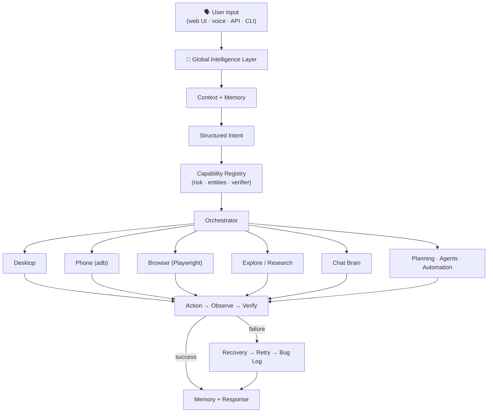

# NovaControl

> 🤖 **An AI-powered desktop automation assistant** — it understands natural-language commands and actually *does* them: driving your desktop, browser, and Android phone, with vision-guided verification, a live web UI, and a built-in bug journal.

NovaControl is a local-first, agentic computer-control system. You type or speak a command like *"open steam and go to library and launch gta v"*, and NovaControl normalizes it, resolves typos and context, plans ordered steps, executes them, and **verifies the result** — asking a precise clarification question only when the request is genuinely ambiguous.

One brain → many capabilities:

| Capability | What it does |
|---|---|
| 🧠 **Global Intelligence Layer** | Normalization, typo tolerance, intent detection, context/reference resolution, multi-intent decomposition |
| 🖥 **Desktop automation** | Open any installed app or folder, in-app chains, dictation, window focus, screenshots (Windows) |
| 🌐 **Browser automation** | Playwright-backed navigation, extraction, form filling, and web-app checks behind an approval policy |
| 👁 **Vision** | Screen understanding, guided clicks ("click the Library button"), pixel-diff verification, optional multimodal vision model |
| 📱 **Phone control** | Android over adb: launch apps, verified screenshots, pre-filled texts/calls |
| 🔎 **Research** | Multi-stage research pipeline that streams live progress into the UI; topics suggested from live daily news, answers synthesized from site-chrome-cleaned facts |
| 💬 **Dual brain** | Fully local scratch brain — incl. worded & exam-grade (JEE) math — or a real LLM (Ollama / OpenAI-compatible / Gemini-style) |

---

## ✨ Key Features

- **Natural-language understanding that forgives humans** — punctuation, capitalization, spacing, and common typos all collapse to the same structured intent:

  | You type | NovaControl understands |
  |---|---|
  | `open chrome`, `open chrome.`, `Open Chrome!`, `OPEN   CHROME`, `please open chrome`, `launch chrome`, `opn chrme` | **OPEN_APPLICATION(chrome)** — all identical |
  | `take a screenshot`, `capture my screen` | **TAKE_SCREENSHOT** |
  | `text mom on my phone saying hi` | **PHONE_SEND_TEXT(recipient: mom, message: hi)** |
  | `open it` (after opening Chrome) | **OPEN_APPLICATION(chrome)** — resolved from context |

- **Layered resolution** — deterministic fast path → fuzzy typo correction → learned variations → contextual/reference resolution → semantic LLM fallback → one precise clarification. Trivial punctuation differences never wake the model.
- **Worded & exam-grade math, fully offline** — the scratch brain's declarative phrase registry computes compound worded arithmetic ("what is 2 cubed plus the square root of 9"), percentages ("15 percent of 200"), unit/time conversions, and JEE-style questions: logs (`log base 2 of 8`), degree trig (`sin 30 degrees`), combinatorics (`10C3`, `8 choose 2`, `factorial of 5`), full quadratic solving with discriminant and roots, and arithmetic-progression term/sum questions.
- **Multi-intent decomposition** — *"open notepad and take a screenshot"* becomes two planned, ordered steps.
- **Concurrent-activity safe** — every research and command execution is tagged with a run-scoped `correlation_id` that flows from the request through the event bus to the SSE channel; the web UI routes each progress frame to the run that owns it, so parallel activities never bleed into each other's panels.
- **Learning loop** — fuzzy/contextual resolutions teach the phrase back to the registry, so the same typo takes the fast path next time.
- **Self-improvement telemetry** — resolutions, clarifications, unknown intents, and failed entity resolutions are recorded and exposed as human-readable improvement findings.
- **Capability registry** — every subsystem declares its intents, required entities, risk level, executor, and *verification strategy*; the orchestrator derives execution and confirmation policy from that table.
- **Safety-first execution** — device actions require a server-minted, single-use, expiring approval token; auto-approve is opt-in.
- **Auto-resolving bug log** — open verification bugs are marked fixed automatically (with evidence) when a later pixel-diff proves the click actually changed the screen.
- **Routing Explorer** — a dedicated panel that traces any utterance through NovaBrain's intent gates, showing which rung owns it and a live preview of what you would actually see (the scratch answer text, the research headline, or the plan outline). Traced by the live server (`POST /brain/decide`); an embedded JS mirror takes over when the server is unreachable. A **broad-classifier toggle** re-runs the same utterance through the scratch engine's wide `_classify()` view and highlights where the narrow gate and the broad engine deliberately disagree (order / engine-only / breadth / unknown / match) — including casual phrasings, which the mirror's research detector knows ("things to know about X", "wtf is X", …), drift-guarded against the Python keyword list.
- **Full phone control over ADB** — the J.A.R.V.I.S phone mode opens any installed app (alias or package), runs in-app searches via deep links (YouTube/Google/Maps/Spotify…), texts saved contacts by name (resolved against the device contact book, never split by guesswork), and opens files/folders through the Files app or system chooser.
- **Answers built from content, not chrome** — search snippets routinely glue consent banners, footers, and trademark lines onto real text. A sentence-level site-chrome filter strips them *before* synthesis, so a researched answer explains the topic instead of quoting "By using this site, you agree to the Terms of Use" or "This page was last edited on …". Chat and Explore share the pipeline **and** the filter, so both answer from the same cleaned facts.
- **Chat stays a conversation; Explore keeps the report** — a research question asked in Chat answers inside the chat stream as a structured answer card (the sourced answer text with its "What it is:" / "Key points:" sections, clickable source chips, and an `explore` chip that jumps to the full report); the full research page — sections, sources rail, related videos, follow-up suggestions — lives only in the Explore panel. "How to" instructional questions route to research instead of the chat fallback, and a compound topic needs two content-word matches before a source is accepted, so "container garden" no longer pulls in Docker pages.
- **Understands casual phrasing** — you don't have to type perfect questions. Scaffold forms ("things to know about X", "what should i know about X", "whats the deal with X", "tell me stuff about X", "any facts about X", "wtf is X") all route to research, and the search topic is anchored to what FOLLOWS the scaffold — so "the most important things to know about brics summit 2026" researches BRICS, not dictionary pages for the word "important". Explicit memory-store phrasing ("remember this: …") still outranks research words inside the remembered content.
- **Daily-updates topic suggestions** — the Explore panel's topic chips are never a hardcoded list: they come from `GET /explore/trending`, which fetches live top-story news headlines (Google News RSS, standard library only, no API key), trims each into a research topic, caches for 30 minutes, invalidates by day, and rotates the visible window hourly — so each visit suggests a different slice of what's actually happening in the world. When the feed is unreachable the panel degrades to a few static help examples.
- **Command-center web UI** — one committed design layer over every panel: a fluid layout (`clamp()` gutters, content-sized rails, breakpoints from 1920px down to phones) that reflows instead of clipping, plus a verified fit audit across all 11 panels and 11 widths.

## 🧠 Architecture



**Language understanding is a platform capability.** No subsystem parses raw user strings on its own — JARVIS, Research, Automation, and the Browser Agent all consume the same structured intent.

### Key modules

```text
src/novacontrol/
  intelligence/   Global Input Intelligence: normalize, intent rules,
                  context/references, capability registry, telemetry,
                  StandardResult envelope
  brain/          Scratch brain (fully local answers) + LLM chat + routing
  desktop/        Desktop controller, parser/planner, vision-guided control
  phone/          adb bridge: connect, apps, texts, calls, screenshots
  browser/        Playwright runner + approval-aware workflow controller
  vision/         Screen understanding (LLM provider, heuristic fallback)
  agentcore/      Task interpreter, adaptive planner, verifier, recovery
  voice/          STT/TTS via OS-native speech services
  tasks/          Task center (create, update, delete, clear)
  core/           Event bus, runtime, config, security (deny-by-default
                  approvals), bug log, audit trail
  explore/        Research pipeline with live progress events
  memory/         Namespaced memory (SQLite-backed)
  api/            FastAPI surface + single SSE activity channel
  web/static/     The web UI (vanilla JS, no build step)
  gui/            PySide6 desktop dashboard
  cli/            Command-line interface and demos
```

### Safety model

- **Deny-by-default approvals** — device actions execute only with a server-minted, single-use, expiring token issued for that exact plan
- **Auto-approve is opt-in** (Settings checkbox, default off)
- Destructive/ambiguous + high-risk intents require explicit confirmation
- Phone texts and calls are **pre-fill only** — the human always presses send/dial on the device
- Self-improvement applies nothing without a sandboxed preview + approval

---

## 🚀 Requirements

| Requirement | Version |
|---|---|
| Python | **3.12+** |
| OS | Windows (desktop + voice features); Linux/macOS for core web/API |
| Ollama (optional) | Any recent version — local chat brain and/or a local vision model (e.g. `ollama pull llama3.2-vision`) |
| Android platform-tools (optional) | For phone control |

## 📦 Installation

```powershell
git clone <your-repo-url>
cd NovaControl

python -m venv .venv
.\.venv\Scripts\Activate.ps1
python -m pip install -e ".[dev]"
```

Optional extras (browser automation, GUI, vision, voice, git, database, Redis):

```powershell
python -m pip install -e ".[browser,gui]"
```

## ⚙️ Configuration

NovaControl is configured via environment variables — no `.env` file is required to run:

| Variable | Purpose | Default |
|---|---|---|
| `NOVACONTROL_API_TOKEN` | Require bearer-token auth on protected API routes | *(auth off)* |
| `NOVACONTROL_ENV` | Environment name | `dev` |
| `NOVACONTROL_LOG_LEVEL` | Logging level | `INFO` |
| `NOVACONTROL_REQUIRE_APPROVAL` | Toggle approval enforcement | `true` |
| `NOVACONTROL_DATABASE_URL` | Database connection (SQLite default) | local SQLite |
| `NOVACONTROL_REDIS_URL` | Redis for optional worker/queue features | — |
| `NOVACONTROL_OLLAMA_URL` | Ollama endpoint for the LLM brain | `http://127.0.0.1:11434` |
| `NOVACONTROL_DISABLE_OLLAMA` | Skip Ollama auto-detection | unset |
| `NOVACONTROL_ENABLE_EXTERNAL_LLM` | Enable OpenAI-compatible/Gemini-style cloud providers | unset |
| `NOVACONTROL_LLM_BASE_URL` | Cloud provider base URL | — |
| `NOVACONTROL_LLM_API_KEY` | Cloud provider API key | — |
| `NOVACONTROL_LLM_MODEL` | Model name | provider default |

> 🔐 **Secret handling:** API keys are stored locally and never returned by any API endpoint. This includes the vision-model key (`POST /vision/model` accepts it once and only ever reports a redacted tail). Never commit `.env` files or tokens — local artifacts like `token.txt` should stay out of version control.

## 🏃 Usage

### Run the web app

```powershell
python -m uvicorn novacontrol.api.app:create_app --factory --host 127.0.0.1 --port 8000
```

Open **http://127.0.0.1:8000/** and try:

- `open notepad and type hello`
- `what is quantum tunneling` (research — streams live stages)
- `take a screenshot on my phone`
- `whats the deal with brics summit 2026` (casual phrasing — routes to research, searches the actual topic)
- The Explore panel opens with **today's news topics** as one-click research chips

### Natural-language command examples

```text
open chrome                              → launches Chrome, verifies the window
open steam and go to library and launch gta v
                                         → 3-step plan: launch → deep-link navigate →
                                           vision-guided launch with process verification
open notepad and type meeting notes      → dictation via clipboard-staged paste
open downloads                           → opens the folder in Explorer
open games folder                        → finds the real folder across drives and opens it
what is 2 cubed plus the square root of 9 → 11 (offline scratch brain)
log base 2 of 8 plus 10C3                → 123 (JEE-style: logs + combinatorics)
solve x^2 - 5x + 6 = 0                   → worked quadratic solution with roots
stop that                                → graceful WM_CLOSE of the last app
open youtube on my phone                 → launches YouTube on the paired device
search cats on youtube on my phone       → YouTube deep-link search (nothing typed)
open the report.pdf file on my phone     → opens the file via the system chooser
open the downloads folder on my phone    → opens the Files app
open steam and go to library and launch gta v
                                         → 3-step desktop plan: launch → deep-link navigate →
                                           vision-guided launch with process verification
take a screenshot on my phone            → PNG pulled to data/screenshots/, verified
text sesi 2 saying hi from NovaControl  → resolves the saved contact → pre-fills messaging; you press send
how to start a container garden on a balcony → researches gardening (not Docker)
whats the deal with quantum computing    → researches quantum computing
tell me stuff about the mariana trench   → researches the mariana trench
remember this: facts about cats          → stores to memory (does NOT research cats)
```

### How Explore understands what you type

Research queries rarely arrive as perfect sentences, so Explore's language layer anchors on **scaffold markers** instead of rigid grammar: the real topic is whatever *follows* "things to know about", "should i know about", "the deal with", "stuff/facts about", "info on", "wtf is", "basics of". The router accepts the same casual forms, so "whats the deal with quantum computing" routes to research *and* searches for quantum computing — not for "deal". Scaffold adjectives never leak into the search (the fix for researching the word "important" instead of the BRICS summit). Sources must clear a topical-relevance gate: a compound topic ("container garden", "brics summit 2026") needs two content-word matches from a page, so Docker and shipping-container pages can't answer a gardening question, while comparison topics ("compare email, chat, and phone calls") stay per-item.

### Web interface

The browser UI is a single-page command center served by the API (`/`): a grouped sidebar (Core / Intelligence / Automation / Engineering) over eleven panels — **Command**, **Chat**, **Explore**, **Routing**, **J.A.R.V.I.S**, **Vision**, **Build**, **Learn**, **System**, **Settings**, **CLI** — backed by one SSE channel (`/events/stream`) for live progress and the Recent Activity timeline.

Layout is fluid rather than fixed: gutters, heights, and rails are `clamp()`-based tokens, so the same markup reflows from a 1920px desktop to a 390px phone without a separate mobile build — below 700px the sidebar becomes a top command deck whose pills **wrap into rows**, so every destination stays visible (never hidden behind a sideways scroll). The stylesheet is a single design-token block plus one component layer — consolidated with a **computed-style A/B audit** (`scripts/ui_audit.py --baseline <old.css>`) that proves a cleanup changed nothing the browser can see — and reduced-motion is respected throughout.

Chat presentation follows conversation conventions on purpose: research answers arrive as structured answer cards — the answer text with its heading sections and bullets, source chips, and an `explore` hand-off chip that renders the already-fetched report into the Explore panel (no second research round-trip) — while the full report furniture (query chip, verification, sources/videos rail, follow-up question chips) remains the Explore panel's job. `ChatResearchBubbleDomTests` pins this split — the Explore page must never render inside the chat stream. The Explore panel's welcome card shows live **trending topic chips** (today's news, rotating hourly) instead of fixed examples.

Verify the UI end to end:

```powershell
$env:PYTHONPATH='src'
python -m pytest tests/ -q            # includes the UI contract + focus-ring + reduced-motion suites
python scripts/ui_audit.py --url http://127.0.0.1:8001/                  # every panel fits at every breakpoint
python scripts/ui_audit.py --url http://127.0.0.1:8001/ --baseline old.css  # zero computed-style drift
```

### Voice input

The J.A.R.V.I.S tab has a **VOICE** button using OS-native speech recognition and synthesis (Windows); see [docs/VOICE.md](docs/VOICE.md).

### Phone control setup

1. Download [Android platform-tools](https://developer.android.com/tools/releases/platform-tools) and unzip (NovaControl auto-finds it in `~/platform-tools` even when it's not on `PATH`)
2. On the device: **Settings → About → tap Build number 7×** → **Developer options → enable USB debugging**
3. Plug in over USB → press **Connect Phone** in the J.A.R.V.I.S tab → accept the RSA prompt on the device

Once paired, phone mode can: **open any installed app** (by alias or package name, discovered from the device), **search inside apps** via deep links (`search cats on youtube on my phone` opens YouTube pre-loaded with the query — nothing is typed), **text a saved contact by name** (the leading words are resolved against the on-device contact book first, so free text is never split by guesswork; the messaging app is pre-filled and *you* press send), **call by saved name** (dialer pre-filled), and **open files/folders** (a named file opens through the system chooser; folders land in the Files app). Bridge status and next steps are surfaced in the J.A.R.V.I.S phone tab, and every executed action lands in the Recent Activity timeline.

### Routing Explorer

The **Routing** panel answers *"where does my utterance land?"*. Type any phrase and it shows the full gate walk — every intent gate NovaBrain evaluates in order, which one matched (and why), the landing intent with confidence, and a small preview of what you would actually see on that rung:

- **scratch** rungs (greetings, math, conversions, knowledge) — the real local answer text;
- **explore** — the report headline the research run would produce;
- **plan / device actions** — the real plan outline and action list.

While the server is up, tracing runs live through `POST /brain/decide` (the landing decision *is* `NovaBrain.decide()` — the explorer can't disagree with chat). If the server is unreachable, an **embedded JS mirror** of the gate table takes over so the explorer still answers offline; it is labelled as approximate in the UI, and its gate names/order are drift-guarded against the Python table in CI.

A **"Compare with broad classifier"** toggle re-runs the same utterance through the scratch engine's *broad* `_classify()` view and highlights where the narrow routing gate and the broad engine deliberately disagree: **order** (e.g. `what time is 2 plus 3` — the narrow router promotes math ahead of time), **engine-only** (`open notepad and type hello` — the broad engine sees desktop_control but its row is routing_safe=False so routing dispatches to real automation instead of a canned answer), **breadth** (a wide engine match with no exact canned key), **unknown** (neither classifier has a local answer), or **match**. The JS mirror computes the same relation offline, and the Python↔JS relation parity is drift-guarded in CI.

### CLI

```powershell
python -m novacontrol            # interactive CLI
python -m novacontrol demo phase12
```

---

## 🔌 API

FastAPI app factory with REST + SSE + WebSocket surfaces. The full route catalog in [docs/API.md](docs/API.md) is **generated** from the shared route registry (`novacontrol.api.route_consumers`) — after adding a route, run `python scripts/generate_api_reference.py` (CI enforces `--check`). The most useful endpoints:

| Method | Route | Purpose |
|---|---|---|
| `POST` | `/ask` | Natural-language entry point — full pipeline |
| `POST` | `/command/plan` · `/command/execute` | Preview a J.A.R.V.I.S plan, then execute with the minted token |
| `GET` | `/phone/status` · `POST /phone/connect` · `/phone/plan` · `/phone/execute` | Phone bridge control |
| `GET`/`POST` | `/vision/describe` · `/vision/click` | Screen understanding and guided clicks |
| `POST` | `/vision/model` · `/vision/model/clear` | Configure/clear the multimodal vision model (hot swap) |
| `GET` | `/intelligence` | GIL telemetry, improvement findings, capability registry |
| `GET` | `/bugs` · `POST /bugs/{id}/fix` · `POST /bugs/clear-fixed` | Bug log review, resolution, and clearing resolved entries |
| `GET` | `/tasks` · `POST /tasks/delete` · `/tasks/clear` | Task center |
| `POST` | `/brain/mode` · `/brain/cloud` | Switch scratch/LLM brain and configure cloud providers |
| `POST` | `/brain/decide` | Trace an utterance through the routing gates, with a per-rung preview |
| `POST` | `/explore` | Research pipeline |
| `GET` | `/explore/trending` | Current daily research topics from live top-story news (rotating window; feeds the Explore panel's chips) |
| `GET` | `/events/stream` | Live SSE activity channel — every frame carries a `correlation_id` |
| `GET` | `/health` · `/status` | Health and route metadata |

Example with auth enabled:

```powershell
$env:NOVACONTROL_API_TOKEN='change-me'

Invoke-RestMethod -Method Post -Uri http://127.0.0.1:8000/ask `
  -Headers @{ Authorization = 'Bearer change-me' } `
  -ContentType 'application/json' `
  -Body '{"text":"open chrome"}'
```

---

## 🖥 Desktop Automation

Windows-first, using Start-Menu scans (`.lnk` index), registry App Paths, UWP/Store catalog, known app aliases, `shell:` deep links, and PowerShell for window verification:

- **Open any installed app or spoken folder** — not just a fixed alias list: Start Menu shortcuts, registry App Paths, UWP/Store apps, and folder names searched across the user profile and drive roots ("open games folder" → `D:\Games` on machines that have one)
- **In-app chains** — *"open steam and go to library and launch gta v"* launches Steam, drives `steam://open/library`, then launches the game via Steam's own `steam://rungameid/<appid>` protocol with a **process-level verification** (window title *or* known launcher process), polled up to 90 s for big titles
- **Dictation** — clipboard-staged paste with foreground-window verification
- **Window focus & graceful stop** — `stop that` sends WM_CLOSE, never a hard kill
- Details: [docs/DESKTOP_AUTOMATION.md](docs/DESKTOP_AUTOMATION.md)

## 🌐 Browser Automation

- `PlaywrightBrowserRunner` (optional extra: `pip install -e ".[browser]"`) with a safe `NoopBrowserRunner` fallback that records intent without launching a browser
- Actions: navigation, extraction, form filling, downloads, web-app checks
- **Approval policy:** navigation/form-fill/download/test actions require approval; extraction from already-available context does not
- Details: [docs/BROWSER_AUTOMATION.md](docs/BROWSER_AUTOMATION.md)

## 👁 Vision

The Vision tab wraps desktop control in a perceive → locate → act → verify loop:

- **Describe Screen** — captures your real screen and reports what's visible
- **Configurable multimodal vision model** — point the whole vision layer at a real vision-capable model (local **Ollama** — llava, llama3.2-vision, moondream — auto-detected; or a cloud preset: **OpenAI, Gemini, OpenRouter**) from the web UI's Vision panel or `POST /vision/model`. The screenshot is embedded as OpenAI-format image content and elements are located **semantically** (a 0–1000 grid point), with OCR/landmarks as automatic fallback. The config hot-swaps at runtime, persists across restarts, and the API key is stored only on your machine and never returned by any endpoint.
- **Guided Click** — type a target ("File", "Library", "Play GTA V"); the vision layer locates it via vision model → OCR → UI landmarks, moves the cursor, clicks, and saves before/after screenshots
- **Pixel-diff verification** — before/after frames are diffed with an **OpenCV fast path** (numpy-backed, with connected-component *change-region localization*: did the click site itself react?) and a pure-Pillow fallback where OpenCV is unavailable; results carry the `verified`/`unverified` status and the change regions
- **Honest verification** — when a click's effect can't be confirmed, it records *unverified* rather than claiming success; open verification bugs auto-resolve when a later verified click proves the change
- Details: [docs/VISION.md](docs/VISION.md)

---

## 🧪 Testing

```powershell
$env:PYTHONPATH='src'
python -m pytest tests/ -q
```

Type checking:

```powershell
python -m mypy src
```

The suite is hermetic: phone and desktop tests use fake runners (`NoopPhoneRunner`, `NoopDesktopRunner`) — no real device or OS interaction during tests. Trending-topic tests inject fake headline fetchers, so the news feature is tested without network too (one live smoke is run manually, not in CI).

UI and rendered-output quality have their own harnesses:

```powershell
python scripts/ui_audit.py --url http://127.0.0.1:8001/        # fit audit: 11 panels x 11 widths
python scripts/ui_audit.py --url http://127.0.0.1:8001/ --baseline old.css   # computed-style A/B
```

For a browser-driven smoke of the real page (guided-click result card, reduced motion), install the browser extra: `pip install -e ".[browser]"` then `python -m playwright install chromium`.

## 🛠 Development

- Docs live in [`docs/`](docs/) — start with [ARCHITECTURE.md](docs/ARCHITECTURE.md), [DEVELOPMENT.md](docs/DEVELOPMENT.md), and [STATUS.md](docs/STATUS.md)
- [AGENTS.md](AGENTS.md) documents architectural conventions for contributors (one language layer, capability registration, verification-first actions)
- Lint with `ruff check src tests` (line length 100, configured in `pyproject.toml`)

## 🐞 Logging, Auditing & Debugging

- **Bug log** — every failed or unverifiable action lands in `data/bugs.json` with *what, where, when*; reviewable in the Vision tab with per-bug "Mark fixed", plus automatic resolution (with evidence) when a later pixel-diff proves the click worked
- **OpenCV-assisted verification** — click verification diffs frames with OpenCV when available (change-region localization around the click site), falling back to Pillow otherwise
- **Audit trail** — executed and denied desktop/browser/phone actions share one timestamped audit log
- **Event bus journal** — durable JSONL event journal plus in-memory journal for diagnostics
- **Live activity** — the web UI's single SSE channel (`/events/stream`) mirrors every subsystem's progress; every frame carries a **`correlation_id`** so two concurrent activities of the same family (a research in Explore while another runs from Chat, or two approved commands) interleave in the UI without mixing rows
- Log level via `NOVACONTROL_LOG_LEVEL`

## 📊 Current Status

| Area | State |
|---|---|
| Global Intelligence Layer | ✅ Complete — regression-tested (punctuation, case, typos, variations, context, multi-intent) |
| Desktop control | ✅ Working (Windows) — apps, folders, chains, dictation, vision-guided clicks |
| Phone control | ✅ Live-verified against a real device (Xiaomi Pad) — any installed app, in-app YouTube/Google/Maps searches, saved-contact texts/calls, files & folders, screenshots |
| Browser automation | ⚠️ Controller + Playwright runner implemented; real-page workflows still maturing |
| Voice | ⚠️ OS-native STT/TTS with graceful fallback; quality depends on platform speech services |
| GUI dashboard | ⚠️ PySide6 app present, secondary to the web UI |
| Vision tab | ✅ Working — guided clicks + pixel-diff verification (OpenCV fast path); optional multimodal vision model (Ollama/OpenAI/Gemini/OpenRouter) upgrades location to semantic |
| Scratch brain math | ✅ Worded arithmetic, conversions, percentages, and JEE-style logs/trig/combinatorics/quadratics/AP — all offline, regression-pinned |
| Research answer quality | ✅ Site-chrome filter (consent banners, footers, trademark lines) applied before synthesis; scaffold-anchored topic extraction ("things to know about brics summit 2026" researches BRICS, not dictionary pages for "important"); topical-relevance guard rejects single-word hijacks on compound topics ("container garden" ≠ Docker) — pinned by `tests/test_synthesizer.py` + `tests/test_explore.py` |
| Trending topic suggestions | ✅ `GET /explore/trending` — live Google News RSS headlines (no API key, no hardcoded lists), cached 30 min, invalidated daily, rotated hourly; offline degrades to static help chips — pinned by `tests/test_explore_trending.py` |
| Web UI / responsive | ✅ Command-center redesign with fluid auto-fit — 11 panels verified overflow-free from 390px to 1920px, plus a computed-style A/B guard for stylesheet cleanups |
| Self-improvement | ⚠️ Telemetry + sandboxed previews implemented; fully autonomous improvement is *not* enabled |

See [docs/STATUS.md](docs/STATUS.md) for the phase-by-phase history.

## ⚠️ Limitations

- Desktop automation is **Windows-only** today (PowerShell, Start Menu, `shell:` URIs)
- Vision-guided clicks work without a vision model via OCR/landmarks, but semantic location needs one configured (Ollama vision model or cloud key)
- The offline scratch brain's research synthesis is deterministic — *sourced* reports need a configured LLM/online provider; without a model the answer is assembled from cleaned snippets, so its depth tracks what search returns
- Chrome filtering removes site furniture from snippets, but it cannot invent missing facts: a topic whose search results are all low quality still yields a shallow answer
- Trending topic suggestions track Google News top stories: very new stories may have thin coverage for a few minutes, and the rotation cadence (30-min refetch, hourly window) is fixed rather than user-configurable
- Template research answers quote source snippets, so bullets can be terse; connecting an LLM (Vision panel → model config) upgrades synthesis to flowing prose
- Phone texts/calls never send/dial themselves — by design
- No packaged binaries yet; run from source

## 🗺 Roadmap

- [ ] Cross-platform desktop automation (macOS/Linux)
- [ ] Vision-verified Steam/library UI state (today only the launch is verified)
- [ ] Non-Ollama local vision-model runtimes (llama.cpp / LM Studio); per-application learned UI maps
- [ ] Packaged desktop distribution
- [ ] Expanded cloud-LLM presets and model routing
- [ ] Trending-chip shuffle (exclude seen topics on demand) and a user-selectable news edition in Settings
- [ ] LLM-powered chat synthesis: flowing prose answers when a model is configured, template fallback otherwise

## 🤝 Contributing

1. Read [AGENTS.md](AGENTS.md) and [docs/DEVELOPMENT.md](docs/DEVELOPMENT.md)
2. Add/extend tests for any new capability — every subsystem has hermetic tests
3. Run `python -m pytest tests/ -q` and `python -m mypy src` before proposing changes
4. Keep language understanding in the Global Intelligence Layer — don't add raw-string matching inside subsystems

## 📄 License

Proprietary — all rights reserved by the NovaControl Contributors. No standalone LICENSE file is distributed yet; contact the project maintainers for reuse terms.

## 👤 Project

Built and maintained by the **NovaControl Contributors** as a local-first exploration of agentic computer control: one brain, many capabilities, honest verification.
