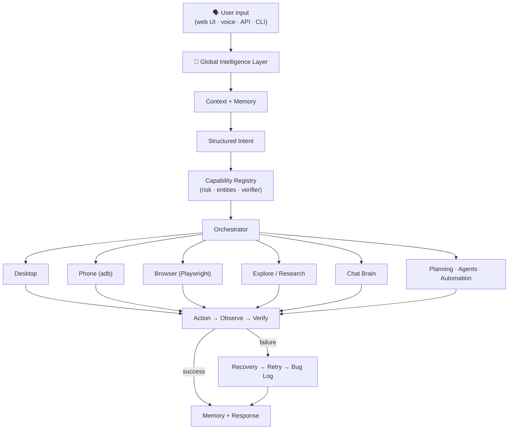

# NovaControl

> 🤖 **An AI-powered desktop automation assistant** — it understands natural-language commands and actually *does* them: driving your desktop, browser, and Android phone, with vision-guided verification, a live web UI, and a built-in bug journal.

NovaControl is a local-first, agentic computer-control system. You type or speak a command like *"open steam and go to library and launch gta v"*, and NovaControl normalizes it, resolves typos and context, plans ordered steps, executes them, and **verifies the result** — asking a precise clarification question only when the request is genuinely ambiguous.

One brain → many capabilities:

| Capability | What it does |
|---|---|
| 🧠 **Global Intelligence Layer** | Normalization, typo tolerance, intent detection, context/reference resolution, multi-intent decomposition |
| 🖥 **Desktop automation** | Open any installed app or folder, in-app chains, dictation, window focus, screenshots (Windows) |
| 🌐 **Browser automation** | Playwright-backed navigation, extraction, form filling, and web-app checks behind an approval policy |
| 👁 **Vision** | Screen understanding, guided clicks ("click the Library button"), pixel-diff verification, optional multimodal vision model |
| 📱 **Phone control** | Android over adb: launch apps, verified screenshots, pre-filled texts/calls |
| 🔎 **Research** | Multi-stage research pipeline that streams live progress into the UI |
| 💬 **Dual brain** | Fully local scratch brain — incl. worded & exam-grade (JEE) math — or a real LLM (Ollama / OpenAI-compatible / Gemini-style) |

---

## ✨ Key Features

- **Natural-language understanding that forgives humans** — punctuation, capitalization, spacing, and common typos all collapse to the same structured intent:

  | You type | NovaControl understands |
  |---|---|
  | `open chrome`, `open chrome.`, `Open Chrome!`, `OPEN   CHROME`, `please open chrome`, `launch chrome`, `opn chrme` | **OPEN_APPLICATION(chrome)** — all identical |
  | `take a screenshot`, `capture my screen` | **TAKE_SCREENSHOT** |
  | `text mom on my phone saying hi` | **PHONE_SEND_TEXT(recipient: mom, message: hi)** |
  | `open it` (after opening Chrome) | **OPEN_APPLICATION(chrome)** — resolved from context |

- **Layered resolution** — deterministic fast path → fuzzy typo correction → learned variations → contextual/reference resolution → semantic LLM fallback → one precise clarification. Trivial punctuation differences never wake the model.
- **Worded & exam-grade math, fully offline** — the scratch brain's declarative phrase registry computes compound worded arithmetic ("what is 2 cubed plus the square root of 9"), percentages ("15 percent of 200"), unit/time conversions, and JEE-style questions: logs (`log base 2 of 8`), degree trig (`sin 30 degrees`), combinatorics (`10C3`, `8 choose 2`, `factorial of 5`), full quadratic solving with discriminant and roots, and arithmetic-progression term/sum questions.
- **Multi-intent decomposition** — *"open notepad and take a screenshot"* becomes two planned, ordered steps.
- **Concurrent-activity safe** — every research and command execution is tagged with a run-scoped `correlation_id` that flows from the request through the event bus to the SSE channel; the web UI routes each progress frame to the run that owns it, so parallel activities never bleed into each other's panels.
- **Learning loop** — fuzzy/contextual resolutions teach the phrase back to the registry, so the same typo takes the fast path next time.
- **Self-improvement telemetry** — resolutions, clarifications, unknown intents, and failed entity resolutions are recorded and exposed as human-readable improvement findings.
- **Capability registry** — every subsystem declares its intents, required entities, risk level, executor, and *verification strategy*; the orchestrator derives execution and confirmation policy from that table.
- **Safety-first execution** — device actions require a server-minted, single-use, expiring approval token; auto-approve is opt-in.
- **Auto-resolving bug log** — open verification bugs are marked fixed automatically (with evidence) when a later pixel-diff proves the click actually changed the screen.

## 🧠 Architecture



**Language understanding is a platform capability.** No subsystem parses raw user strings on its own — JARVIS, Research, Automation, and the Browser Agent all consume the same structured intent.

### Key modules

```text
src/novacontrol/
  intelligence/   Global Input Intelligence: normalize, intent rules,
                  context/references, capability registry, telemetry,
                  StandardResult envelope
  brain/          Scratch brain (fully local answers) + LLM chat + routing
  desktop/        Desktop controller, parser/planner, vision-guided control
  phone/          adb bridge: connect, apps, texts, calls, screenshots
  browser/        Playwright runner + approval-aware workflow controller
  vision/         Screen understanding (LLM provider, heuristic fallback)
  agentcore/      Task interpreter, adaptive planner, verifier, recovery
  voice/          STT/TTS via OS-native speech services
  tasks/          Task center (create, update, delete, clear)
  core/           Event bus, runtime, config, security (deny-by-default
                  approvals), bug log, audit trail
  explore/        Research pipeline with live progress events
  memory/         Namespaced memory (SQLite-backed)
  api/            FastAPI surface + single SSE activity channel
  web/static/     The web UI (vanilla JS, no build step)
  gui/            PySide6 desktop dashboard
  cli/            Command-line interface and demos
```

### Safety model

- **Deny-by-default approvals** — device actions execute only with a server-minted, single-use, expiring token issued for that exact plan
- **Auto-approve is opt-in** (Settings checkbox, default off)
- Destructive/ambiguous + high-risk intents require explicit confirmation
- Phone texts and calls are **pre-fill only** — the human always presses send/dial on the device
- Self-improvement applies nothing without a sandboxed preview + approval

---

## 🚀 Requirements

| Requirement | Version |
|---|---|
| Python | **3.12+** |
| OS | Windows (desktop + voice features); Linux/macOS for core web/API |
| Ollama (optional) | Any recent version — local chat brain and/or a local vision model (e.g. `ollama pull llama3.2-vision`) |
| Android platform-tools (optional) | For phone control |

## 📦 Installation

```powershell
git clone <your-repo-url>
cd NovaControl

python -m venv .venv
.\.venv\Scripts\Activate.ps1
python -m pip install -e ".[dev]"
```

Optional extras (browser automation, GUI, vision, voice, git, database, Redis):

```powershell
python -m pip install -e ".[browser,gui]"
```

## ⚙️ Configuration

NovaControl is configured via environment variables — no `.env` file is required to run:

| Variable | Purpose | Default |
|---|---|---|
| `NOVACONTROL_API_TOKEN` | Require bearer-token auth on protected API routes | *(auth off)* |
| `NOVACONTROL_ENV` | Environment name | `dev` |
| `NOVACONTROL_LOG_LEVEL` | Logging level | `INFO` |
| `NOVACONTROL_REQUIRE_APPROVAL` | Toggle approval enforcement | `true` |
| `NOVACONTROL_DATABASE_URL` | Database connection (SQLite default) | local SQLite |
| `NOVACONTROL_REDIS_URL` | Redis for optional worker/queue features | — |
| `NOVACONTROL_OLLAMA_URL` | Ollama endpoint for the LLM brain | `http://127.0.0.1:11434` |
| `NOVACONTROL_DISABLE_OLLAMA` | Skip Ollama auto-detection | unset |
| `NOVACONTROL_ENABLE_EXTERNAL_LLM` | Enable OpenAI-compatible/Gemini-style cloud providers | unset |
| `NOVACONTROL_LLM_BASE_URL` | Cloud provider base URL | — |
| `NOVACONTROL_LLM_API_KEY` | Cloud provider API key | — |
| `NOVACONTROL_LLM_MODEL` | Model name | provider default |

> 🔐 **Secret handling:** API keys are stored locally and never returned by any API endpoint. This includes the vision-model key (`POST /vision/model` accepts it once and only ever reports a redacted tail). Never commit `.env` files or tokens — local artifacts like `token.txt` should stay out of version control.

## 🏃 Usage

### Run the web app

```powershell
python -m uvicorn novacontrol.api.app:create_app --factory --host 127.0.0.1 --port 8000
```

Open **http://127.0.0.1:8000/** and try:

- `open notepad and type hello`
- `what is quantum tunneling` (research — streams live stages)
- `take a screenshot on my phone`

### Natural-language command examples

```text
open chrome                              → launches Chrome, verifies the window
open steam and go to library and launch gta v
                                         → 3-step plan: launch → deep-link navigate →
                                           vision-guided launch with process verification
open notepad and type meeting notes      → dictation via clipboard-staged paste
open downloads                           → opens the folder in Explorer
open games folder                        → finds the real folder across drives and opens it
what is 2 cubed plus the square root of 9 → 11 (offline scratch brain)
log base 2 of 8 plus 10C3                → 123 (JEE-style: logs + combinatorics)
solve x^2 - 5x + 6 = 0                   → worked quadratic solution with roots
stop that                                → graceful WM_CLOSE of the last app
take a screenshot on my phone            → PNG pulled to data/screenshots/, verified
text mom saying hi from NovaControl      → pre-fills messaging; you press send
```

### Voice input

The J.A.R.V.I.S tab has a **VOICE** button using OS-native speech recognition and synthesis (Windows); see [docs/VOICE.md](docs/VOICE.md).

### Phone control setup

1. Download [Android platform-tools](https://developer.android.com/tools/releases/platform-tools) and unzip (NovaControl auto-finds it in `~/platform-tools` even when it's not on `PATH`)
2. On the device: **Settings → About → tap Build number 7×** → **Developer options → enable USB debugging**
3. Plug in over USB → press **Connect Phone** in the J.A.R.V.I.S tab → accept the RSA prompt on the device

### CLI

```powershell
python -m novacontrol            # interactive CLI
python -m novacontrol demo phase12
```

---

## 🔌 API

FastAPI app factory with REST + SSE + WebSocket surfaces. Full route catalog in [docs/API.md](docs/API.md); the most useful endpoints:

| Method | Route | Purpose |
|---|---|---|
| `POST` | `/ask` | Natural-language entry point — full pipeline |
| `POST` | `/command/plan` · `/command/execute` | Preview a J.A.R.V.I.S plan, then execute with the minted token |
| `GET` | `/phone/status` · `POST /phone/connect` · `/phone/plan` · `/phone/execute` | Phone bridge control |
| `GET`/`POST` | `/vision/describe` · `/vision/click` | Screen understanding and guided clicks |
| `POST` | `/vision/model` · `/vision/model/clear` | Configure/clear the multimodal vision model (hot swap) |
| `GET` | `/intelligence` | GIL telemetry, improvement findings, capability registry |
| `GET` | `/bugs` · `POST /bugs/{id}/fix` | Bug log review and resolution |
| `GET` | `/tasks` · `POST /tasks/delete` · `/tasks/clear` | Task center |
| `POST` | `/brain/mode` · `/brain/cloud` | Switch scratch/LLM brain and configure cloud providers |
| `POST` | `/explore` | Research pipeline |
| `GET` | `/events/stream` | Live SSE activity channel — every frame carries a `correlation_id` |
| `GET` | `/health` · `/status` | Health and route metadata |

Example with auth enabled:

```powershell
$env:NOVACONTROL_API_TOKEN='change-me'

Invoke-RestMethod -Method Post -Uri http://127.0.0.1:8000/ask `
  -Headers @{ Authorization = 'Bearer change-me' } `
  -ContentType 'application/json' `
  -Body '{"text":"open chrome"}'
```

---

## 🖥 Desktop Automation

Windows-first, using Start-Menu scans (`.lnk` index), registry App Paths, UWP/Store catalog, known app aliases, `shell:` deep links, and PowerShell for window verification:

- **Open any installed app or spoken folder** — not just a fixed alias list: Start Menu shortcuts, registry App Paths, UWP/Store apps, and folder names searched across the user profile and drive roots ("open games folder" → `D:\Games` on machines that have one)
- **In-app chains** — *"open steam and go to library and launch gta v"* launches Steam, drives `steam://open/library`, then launches the game via Steam's own `steam://rungameid/<appid>` protocol with a **process-level verification** (window title *or* known launcher process), polled up to 90 s for big titles
- **Dictation** — clipboard-staged paste with foreground-window verification
- **Window focus & graceful stop** — `stop that` sends WM_CLOSE, never a hard kill
- Details: [docs/DESKTOP_AUTOMATION.md](docs/DESKTOP_AUTOMATION.md)

## 🌐 Browser Automation

- `PlaywrightBrowserRunner` (optional extra: `pip install -e ".[browser]"`) with a safe `NoopBrowserRunner` fallback that records intent without launching a browser
- Actions: navigation, extraction, form filling, downloads, web-app checks
- **Approval policy:** navigation/form-fill/download/test actions require approval; extraction from already-available context does not
- Details: [docs/BROWSER_AUTOMATION.md](docs/BROWSER_AUTOMATION.md)

## 👁 Vision

The Vision tab wraps desktop control in a perceive → locate → act → verify loop:

- **Describe Screen** — captures your real screen and reports what's visible
- **Configurable multimodal vision model** — point the whole vision layer at a real vision-capable model (local **Ollama** — llava, llama3.2-vision, moondream — auto-detected; or a cloud preset: **OpenAI, Gemini, OpenRouter**) from the web UI's Vision panel or `POST /vision/model`. The screenshot is embedded as OpenAI-format image content and elements are located **semantically** (a 0–1000 grid point), with OCR/landmarks as automatic fallback. The config hot-swaps at runtime, persists across restarts, and the API key is stored only on your machine and never returned by any endpoint.
- **Guided Click** — type a target ("File", "Library", "Play GTA V"); the vision layer locates it via vision model → OCR → UI landmarks, moves the cursor, clicks, and saves before/after screenshots
- **Pixel-diff verification** — before/after frames are diffed with an **OpenCV fast path** (numpy-backed, with connected-component *change-region localization*: did the click site itself react?) and a pure-Pillow fallback where OpenCV is unavailable; results carry the `verified`/`unverified` status and the change regions
- **Honest verification** — when a click's effect can't be confirmed, it records *unverified* rather than claiming success; open verification bugs auto-resolve when a later verified click proves the change
- Details: [docs/VISION.md](docs/VISION.md)

---

## 🧪 Testing

```powershell
$env:PYTHONPATH='src'
python -m pytest tests/ -q
```

Type checking:

```powershell
python -m mypy src
```

The suite is hermetic: phone and desktop tests use fake runners (`NoopPhoneRunner`, `NoopDesktopRunner`) — no real device or OS interaction during tests.

## 🛠 Development

- Docs live in [`docs/`](docs/) — start with [ARCHITECTURE.md](docs/ARCHITECTURE.md), [DEVELOPMENT.md](docs/DEVELOPMENT.md), and [STATUS.md](docs/STATUS.md)
- [AGENTS.md](AGENTS.md) documents architectural conventions for contributors (one language layer, capability registration, verification-first actions)
- Lint with `ruff check src tests` (line length 100, configured in `pyproject.toml`)

## 🐞 Logging, Auditing & Debugging

- **Bug log** — every failed or unverifiable action lands in `data/bugs.json` with *what, where, when*; reviewable in the Vision tab with per-bug "Mark fixed", plus automatic resolution (with evidence) when a later pixel-diff proves the click worked
- **OpenCV-assisted verification** — click verification diffs frames with OpenCV when available (change-region localization around the click site), falling back to Pillow otherwise
- **Audit trail** — executed and denied desktop/browser/phone actions share one timestamped audit log
- **Event bus journal** — durable JSONL event journal plus in-memory journal for diagnostics
- **Live activity** — the web UI's single SSE channel (`/events/stream`) mirrors every subsystem's progress; every frame carries a **`correlation_id`** so two concurrent activities of the same family (a research in Explore while another runs from Chat, or two approved commands) interleave in the UI without mixing rows
- Log level via `NOVACONTROL_LOG_LEVEL`

## 📊 Current Status

| Area | State |
|---|---|
| Global Intelligence Layer | ✅ Complete — regression-tested (punctuation, case, typos, variations, context, multi-intent) |
| Desktop control | ✅ Working (Windows) — apps, folders, chains, dictation, vision-guided clicks |
| Phone control | ✅ Live-verified against a real device — apps, screenshots, pre-filled texts/calls |
| Browser automation | ⚠️ Controller + Playwright runner implemented; real-page workflows still maturing |
| Voice | ⚠️ OS-native STT/TTS with graceful fallback; quality depends on platform speech services |
| GUI dashboard | ⚠️ PySide6 app present, secondary to the web UI |
| Vision tab | ✅ Working — guided clicks + pixel-diff verification (OpenCV fast path); optional multimodal vision model (Ollama/OpenAI/Gemini/OpenRouter) upgrades location to semantic |
| Scratch brain math | ✅ Worded arithmetic, conversions, percentages, and JEE-style logs/trig/combinatorics/quadratics/AP — all offline, regression-pinned |
| Self-improvement | ⚠️ Telemetry + sandboxed previews implemented; fully autonomous improvement is *not* enabled |

See [docs/STATUS.md](docs/STATUS.md) for the phase-by-phase history.

## ⚠️ Limitations

- Desktop automation is **Windows-only** today (PowerShell, Start Menu, `shell:` URIs)
- Vision-guided clicks work without a vision model via OCR/landmarks, but semantic location needs one configured (Ollama vision model or cloud key)
- The offline scratch brain's research synthesis is deterministic — *sourced* reports need a configured LLM/online provider
- Phone texts/calls never send/dial themselves — by design
- No packaged binaries yet; run from source

## 🗺 Roadmap

- [ ] Cross-platform desktop automation (macOS/Linux)
- [ ] Vision-verified Steam/library UI state (today only the launch is verified)
- [ ] Non-Ollama local vision-model runtimes (llama.cpp / LM Studio); per-application learned UI maps
- [ ] Packaged desktop distribution
- [ ] Expanded cloud-LLM presets and model routing

## 🤝 Contributing

1. Read [AGENTS.md](AGENTS.md) and [docs/DEVELOPMENT.md](docs/DEVELOPMENT.md)
2. Add/extend tests for any new capability — every subsystem has hermetic tests
3. Run `python -m pytest tests/ -q` and `python -m mypy src` before proposing changes
4. Keep language understanding in the Global Intelligence Layer — don't add raw-string matching inside subsystems

## 📄 License

Proprietary — all rights reserved by the NovaControl Contributors. No standalone LICENSE file is distributed yet; contact the project maintainers for reuse terms.

## 👤 Project

Built and maintained by the **NovaControl Contributors** as a local-first exploration of agentic computer control: one brain, many capabilities, honest verification.
