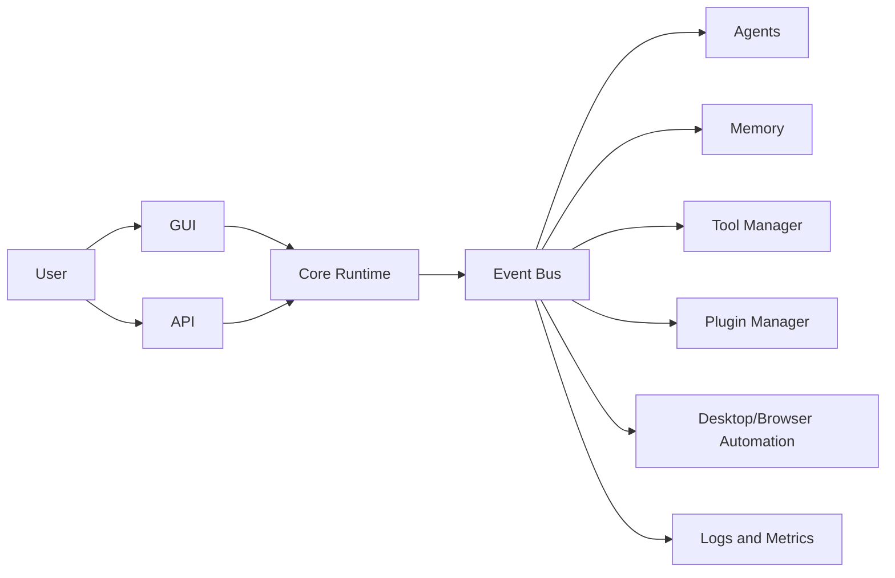

# NovaControl Architecture

NovaControl is organized as an event-driven platform. The core owns runtime coordination, contracts, configuration, observability, and security policy. Feature modules plug into the core by implementing interfaces and subscribing to events.

## Dependency Rule

Feature modules may import from `novacontrol.core`. Feature modules must not import each other directly. Cross-module communication uses:

- Events published through `EventBus`
- Interface contracts from `novacontrol.core.interfaces`
- Runtime registration through `RuntimeModule`

This keeps the core stable as future capabilities such as robotics, simulation, reinforcement learning, and multimodal models are added.

## Core Components

- `EventBus`: async publish/subscribe mechanism for typed events
- `EventJournal`: append/read contract for durable event records
- `Event`: immutable message containing type, payload, source, correlation id, and timestamp
- `RuntimeModule`: lifecycle contract for independently managed modules
- `EventDrivenRuntime`: registers modules and starts/stops them predictably
- `ServiceContainer`: explicit registry for runtime services and adapters
- `DiagnosticsRegistry`: runtime health checks and status reports
- `RetryPolicy`: bounded retry behavior for lifecycle operations
- `NovaControlConfig`: configuration object loaded from defaults, files, and environment
- `ApprovalGateway`: security boundary for sensitive actions

## Module Boundaries

Each module is expected to expose a narrow adapter to the runtime. Internal details stay private to that module.

## Event Naming

Event types use dotted names:

- `user.requested`
- `task.created`
- `agent.delegated`
- `tool.requested`
- `approval.required`
- `memory.retrieved`
- `workflow.completed`

## Security Model

Sensitive actions must be represented as explicit requests that can be approved, denied, audited, and replayed for review. Examples include filesystem mutation, command execution, browser form submission, credential access, and desktop automation.

Phase 1 includes policy and approval primitives only. Later phases will connect those primitives to UI prompts, API prompts, sandboxing, and audit persistence.

See [CORE_ENGINE.md](CORE_ENGINE.md) for Phase 2 runtime details.

See [MEMORY.md](MEMORY.md) for Phase 3 memory details.

See [TOOLS.md](TOOLS.md) for Phase 4 tool execution and approval details.

See [AGENTS.md](AGENTS.md) for Phase 5 multi-agent details.

See [PLANNING.md](PLANNING.md) for Phase 6 workflow planning details.

See [DESKTOP_AUTOMATION.md](DESKTOP_AUTOMATION.md) for Phase 7 desktop automation details.

See [BROWSER_AUTOMATION.md](BROWSER_AUTOMATION.md) for Phase 8 browser automation details.

See [VISION.md](VISION.md) for Phase 9 vision details.

See [EXPLORE.md](EXPLORE.md) for the requested online research and video learning workflow.

See [VOICE.md](VOICE.md) for Phase 10 voice details.

See [GUI.md](GUI.md) for Phase 11 GUI details.

See [API.md](API.md) for Phase 12 REST and WebSocket details.

See [PLUGIN_MARKETPLACE.md](PLUGIN_MARKETPLACE.md) for Phase 13 plugin marketplace details.

See [PERFORMANCE.md](PERFORMANCE.md) for Phase 14 performance details.
