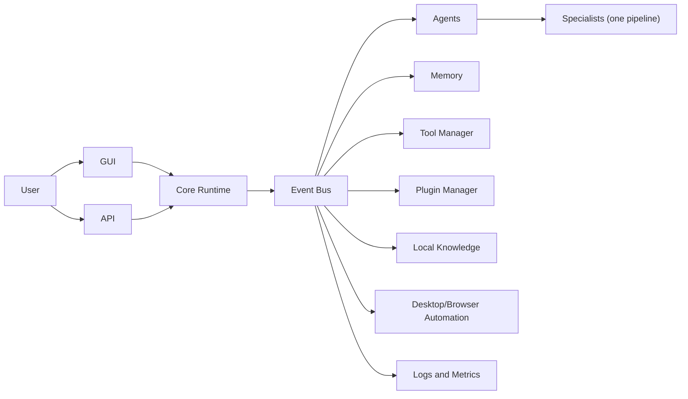

# NovaControl Architecture

NovaControl is organized as an event-driven platform. The core owns runtime coordination, contracts, configuration, observability, and security policy. Feature modules plug into the core by implementing interfaces and subscribing to events.

## Dependency Rule

Feature modules may import from `novacontrol.core`. Feature modules must not import each other directly. Cross-module communication uses:

- Events published through `EventBus`
- Interface contracts from `novacontrol.core.interfaces`
- Runtime registration through `RuntimeModule`

This keeps the core stable as future capabilities such as robotics, simulation, reinforcement learning, and multimodal models are added.

## Core Components

- `EventBus`: async publish/subscribe mechanism for typed events
- `EventJournal`: append/read contract for durable event records
- `Event`: immutable message containing type, payload, source, correlation id, and timestamp
- `RuntimeModule`: lifecycle contract for independently managed modules
- `EventDrivenRuntime`: registers modules and starts/stops them predictably
- `ServiceContainer`: explicit registry for runtime services and adapters
- `DiagnosticsRegistry`: runtime health checks and status reports
- `RetryPolicy`: bounded retry behavior for lifecycle operations
- `NovaControlConfig`: configuration object loaded from defaults, files, and environment
- `ApprovalGateway`: security boundary for sensitive actions
- `KnowledgeManager`: the local pipeline `ingest → chunk → index → retrieve → rerank → context`, plus the versions and hashes that make re-ingesting cheap
- `ProjectContext` / `ProjectDetector`: the code project the user is standing in, read from the workspace and never written to
- `SpecialistPipeline` / `SpecialistAgent`: the one stage loop every specialized agent runs (`NLU → Context → Decision → Planner → Tool Selection → Execution → Verification → Recovery`), with the developer and research agents written as stage hooks on it

## Module Boundaries

Each module is expected to expose a narrow adapter to the runtime. Internal details stay private to that module.

```mermaid
flowchart LR
    User["User"] --> GUI["GUI"]
    User --> API["API"]
    GUI --> Core["Core Runtime"]
    API --> Core
    Core --> Bus["Event Bus"]
    Bus --> Agents["Agents"]
    Agents --> Specialists["Specialists (one pipeline)"]
    Bus --> Memory["Memory"]
    Bus --> Tools["Tool Manager"]
    Bus --> Plugins["Plugin Manager"]
    Bus --> Knowledge["Local Knowledge"]
    Bus --> Automation["Desktop/Browser Automation"]
    Bus --> Observability["Logs and Metrics"]
```

## Event Naming

Event types use dotted names:

- `user.requested`
- `task.created`
- `agent.delegated`
- `tool.requested`
- `approval.required`
- `memory.retrieved`
- `workflow.completed`

The live request path publishes the typed vocabulary declared in `novacontrol.core.events.EventType` — `intent.detected`, `context.resolved`, `decision.created`, `plan.created`, `task.started`/`paused`/`resumed`/`cancelled`/`completed`/`failed`, `tool.selected`/`started`/`completed`/`failed`, `verification.started`/`completed`, `recovery.started`/`completed`, `model.loaded`/`unloaded`, `vision.started`/`completed`, `plugin.loaded`/`initialized`/`enabled`/`disabled`/`unloaded`/`failed`, `knowledge.indexed`/`retrieved`. Every name has a payload schema (`EVENT_PAYLOAD_FIELDS`) that the publisher validates against, so a malformed event fails where it is created instead of at a subscriber; `Event.child`/`Event.of` keep the request's `correlation_id` on nested work, and `EventBus.emit` cannot raise because a subscriber failed. Subscriber kwargs named `source`, `correlation_id` or `causation_id` are the envelope's, not the payload's — a payload key must never shadow one.

## Security Model

Sensitive actions must be represented as explicit requests that can be approved, denied, audited, and replayed for review. Examples include filesystem mutation, command execution, browser form submission, credential access, and desktop automation.

Phase 1 includes policy and approval primitives only. Later phases will connect those primitives to UI prompts, API prompts, sandboxing, and audit persistence.

See [CORE_ENGINE.md](CORE_ENGINE.md) for Phase 2 runtime details.

See [MEMORY.md](MEMORY.md) for Phase 3 memory details.

See [TOOLS.md](TOOLS.md) for Phase 4 tool execution and approval details.

See [AGENTS.md](AGENTS.md) for Phase 5 multi-agent details.

See [PLANNING.md](PLANNING.md) for Phase 6 workflow planning details.

See [DESKTOP_AUTOMATION.md](DESKTOP_AUTOMATION.md) for Phase 7 desktop automation details.

See [BROWSER_AUTOMATION.md](BROWSER_AUTOMATION.md) for Phase 8 browser automation details.

See [VISION.md](VISION.md) for Phase 9 vision details.

See [EXPLORE.md](EXPLORE.md) for the requested online research and video learning workflow.

See [VOICE.md](VOICE.md) for Phase 10 voice details.

See [GUI.md](GUI.md) for Phase 11 GUI details.

See [API.md](API.md) for Phase 12 REST and WebSocket details.

See [SPECIALIST_AGENTS.md](SPECIALIST_AGENTS.md) for the staged-build specialized agents and the one pipeline they share.

See [PLUGIN_MARKETPLACE.md](PLUGIN_MARKETPLACE.md) for Phase 13 plugin marketplace details and [PLUGIN_GUIDE.md](PLUGIN_GUIDE.md) for the Phase 10 plugin SDK.

See [PERFORMANCE.md](PERFORMANCE.md) for Phase 14 performance details.

## Staged Build (Phases 1–11)

The phase documents above describe the original fifteen-phase baseline. The staged build that followed extends those layers in place instead of adding a second architecture: `reliability/` composes the planner's verifier and recovery advisor with a formally checked task state machine and one ordered permission layer, and every component publishes through the core event bus behind an injected observer or sink rather than importing it. `intelligence.CapabilityRegistry` reports what this installation can do — declared verbs, tools projected live from the catalogue, and application-level actions — with availability **measured** against the machine at read time (a missing model or tool is UNAVAILABLE with the reason; an unprobeable requirement is UNKNOWN, never "available"). `plugins/` adds the extension boundary: a stable `Plugin` interface, a `PluginManager` that discovers, validates, runs and CONTAINS plugins (a plugin failure is a record with a reason, never a crash), and its tools/capabilities register into the same `ToolRegistry`, `ToolCatalog` and `CapabilityRegistry` the core uses — withdrawn again when the plugin is disabled or unloaded. `knowledge/` adds the memory of the WORKSPACE rather than of the conversation: documents, notes, code and PDFs read off disk, chunked along their own structure, indexed with BM25 over every chunk plus optional vectors over the same, retrieved with the evidence attached and reranked by project, kind and recency, then spent against a token budget that COUNTS what it left out. It is local-first by construction — the default backend is a dependency-free hashing embedder and a real model is supplied per batch and released again, so a machine with no model still answers — and project awareness reads (root, repository, branch, language, framework, recent files, open errors, test status) without ever writing to the tree. See [KNOWLEDGE.md](KNOWLEDGE.md). `agents/` adds the specialized agents the same way, and by the phase's one rule: there is no second agent framework. `SpecialistPipeline` is the only loop a specialist runs — **NLU → Context → Decision → Planner → Tool Selection → Execution → Verification → Recovery** — with each stage being the component that already existed (`TaskInterpreter` for NLU, the knowledge engine's `context_for` for Context, the `PermissionManager`, the approval gateway and the live tool registry for Tool Selection, the `VerificationResult` and `RecoveryStrategy` vocabularies for the last two stages), and a specialist is a set of hooks on it, so the developer agent (inspect, search, plan, write only when authorized, test, debug, git) and the research agent (cited claims, evidence labelled apart from inference) cannot differ in how carefully they verify or how they are authorized. Every run records all eight stages in order, refuses to report COMPLETED unless a step was verified PASS, and gets its authority from the same deny-by-default risk layer as the rest of the build. See [SPECIALIST_AGENTS.md](SPECIALIST_AGENTS.md).

See [STATUS.md](STATUS.md) for the phase summaries and [DEVELOPMENT_LOG.md](DEVELOPMENT_LOG.md) for the defects each verification pass found.
